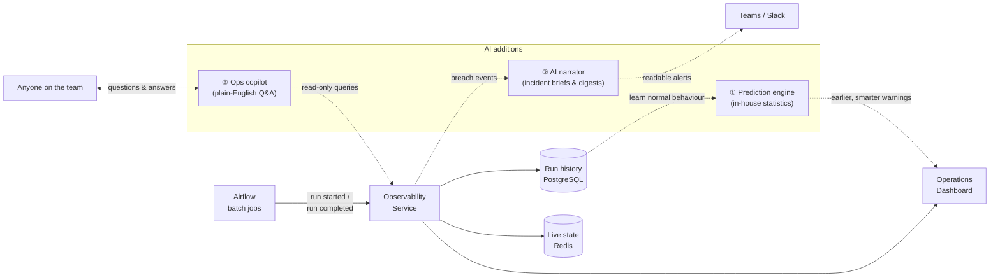
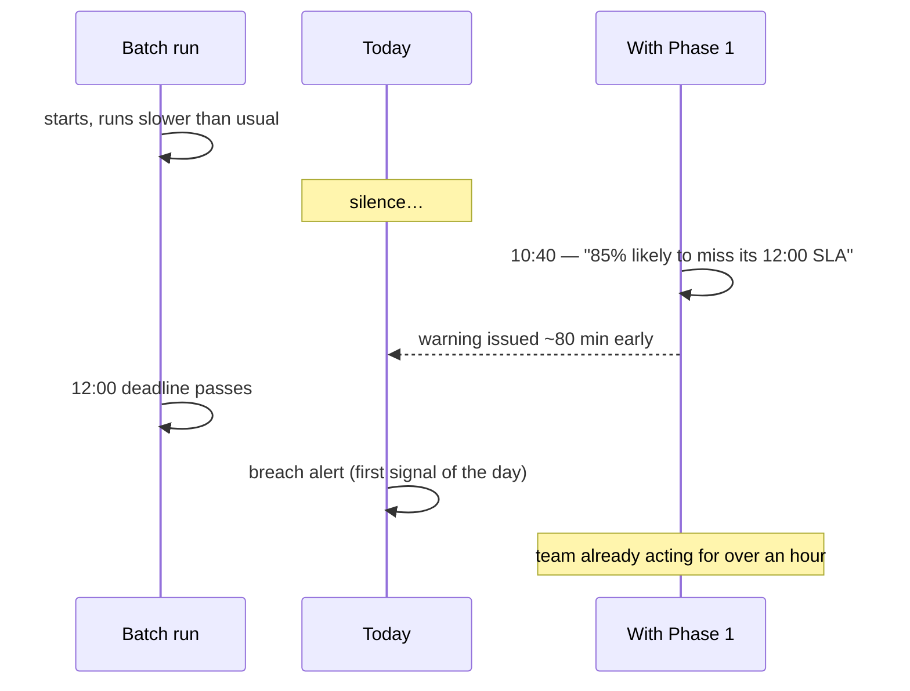
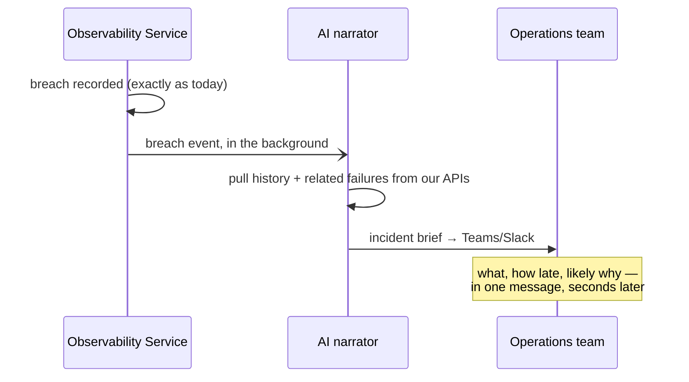
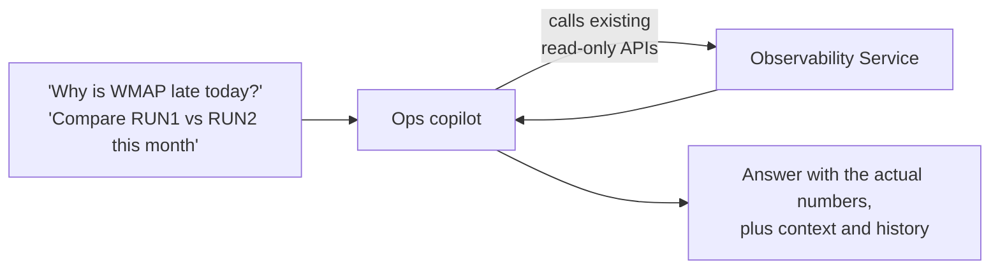

# Bringing AI into the Batch Observability Platform

*Proposal for senior management — July 2026*

---

## Executive summary

Our observability service tells us **what happened**: it records every batch run, compares it against its SLA deadline, and raises a breach after the deadline has passed. The opportunity with AI is to move up the value chain:

| Today | With AI |
|---|---|
| We find out a run is late **after** the deadline passes | We are warned **60–90 minutes earlier** that a run is trending late |
| A breach produces a raw log entry an engineer must investigate | A breach produces a **ready-made incident brief**: what, how late, likely why |
| Answers require an engineer who knows the dashboards and data | Anyone can ask in plain English: *"Why is the WMAP batch late today?"* |

Three phases. **Phase 1 requires no AI vendor, no new infrastructure, and no data leaving our platform** — it is statistical intelligence built on the run history we already store. Later phases add AI-generated explanations and a conversational assistant, both deliberately kept **outside** the core data path.

---

## Where AI plugs in

One picture of the platform with the three AI additions. Nothing in the existing pipeline (solid boxes) changes — AI components (numbered) attach at the edges and consume data we already collect.

---

## Phase 1 — Predict: know before it breaks

*In-house statistics on our own data. No AI vendor, no data egress.*

The service already stores months of run history per calculator. Today we use it only for a flat average. Phase 1 turns that history into foresight:

- **Smarter expected durations.** Month-end runs are systematically slower than mid-month runs; day of week matters too. Baselines that understand this make every estimate and deadline check more accurate.
- **Predictive breach warning.** Instead of warning a fixed 10 minutes before a deadline, continuously ask: *given how long this run has already been running, what is the probability it still finishes on time?* When that probability drops, warn — often more than an hour before the deadline.
- **Late-start detection.** Some SLAs are anchored to when a run starts, so an upstream delay is invisible until far too late. Learning each calculator's normal start time lets us flag "this run started 2 hours later than usual" immediately — closing a known blind spot.
- **Trend drift alerts.** Detect when a calculator's runtime has quietly shifted (e.g. +30% since a code change) *before* the creep turns into breaches.

**How the experience changes:**

---

## Phase 2 — Explain: alerts people can act on

*First use of a generative AI model — strictly to narrate facts our database already computed.*

- **Incident briefs.** When a breach happens, AI assembles a short readable brief and posts it to Teams/Slack: which calculator, how late, its recent track record, other calculators failing on the same reporting date, and the likely cause category (started late vs ran slow vs failed outright). What takes an engineer 30–45 minutes of dashboard archaeology arrives pre-assembled in seconds.
- **Morning digest.** A daily 7 a.m. summary of the overnight batch estate: what ran, what breached, what is drifting. The numbers come from our database; AI only writes the prose.
- **Failure categorisation.** Error messages are free text today. AI files each failure into a small set of categories (infrastructure, data quality, upstream delay, code error), unlocking "top failure causes this quarter" reporting.

If the AI service is ever unavailable, the raw alert still fires — narration is an enhancement, never a dependency.

---

## Phase 3 — Converse: ask the platform anything

A read-only **ops copilot** connected to the service's existing, secured query APIs — the same ones the dashboard uses. No new query engine, no direct database access for the AI.

Value: support and management self-serve answers that today require a platform engineer.

---

## Guardrails (why this is low-risk)

1. **AI never touches the core path.** Run ingestion, SLA detection, and data storage remain exactly as they are — AI attaches via background events and read-only queries.
2. **Numbers come from the database, AI writes only prose.** No AI-invented figures.
3. **Fails safe.** If any AI component is down, monitoring and alerting behave exactly as today.
4. **Read-only copilot.** The assistant can query, never change, anything.
5. **Bounded cost.** Phase 1 has zero vendor cost; Phases 2–3 use AI in small, event-driven doses (per breach / per day / per question), not continuously.

---

## Roadmap

| Phase | Delivers | Dependencies | Indicative effort |
|---|---|---|---|
| **1 — Predict** | Early warnings, late-start detection, drift alerts | None — our data, our code | ~2–3 weeks |
| **2 — Explain** | Incident briefs, morning digest, failure categories | AI provider sign-off + Teams/Slack channel (needed anyway — alerting is currently log-only) | ~2–3 weeks |
| **3 — Converse** | Plain-English ops copilot | Approved AI assistant tooling in the org | ~1–2 weeks |

Recommended order is 1 → 2 → 3: Phase 1 pays for itself immediately with no external dependency, and its outputs (predictions, drift flags, categories) are precisely what makes Phases 2–3 substantive rather than cosmetic.

---

## On approval — what gets produced

1. This proposal saved into the repo as `docs/proposals/2026-07-19-ai-observability-proposal.md` (diagrams render natively on GitHub/IDE).
2. Optionally, a polished shareable web page version for circulating to management.

No code, no AI API connection, and no runtime changes are part of this deliverable. Implementation planning for Phase 1 starts only when management green-lights it.

## Verification

Design-only deliverable — verify by reviewing the document and confirming the mermaid diagrams render (GitHub preview or IDE markdown preview).
