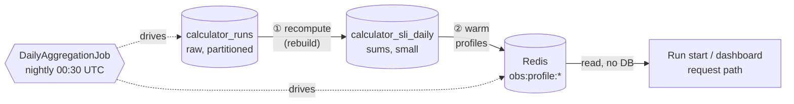
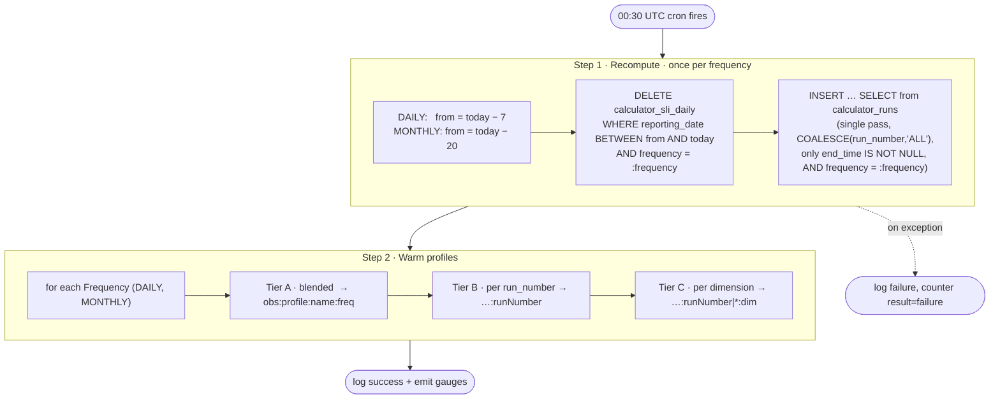
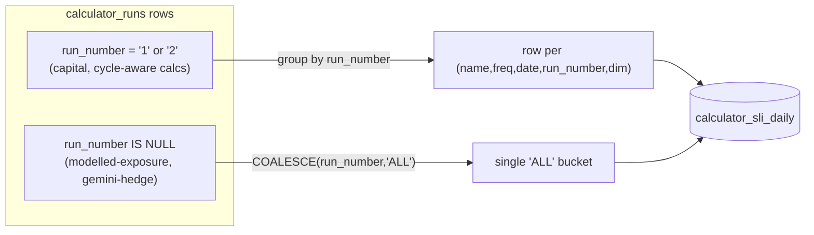
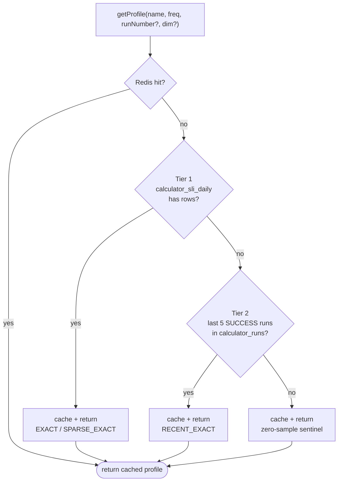

# Daily Aggregation — User & Spec Guide

**What it is:** A nightly batch job that summarises raw run history into a small,
fast-to-read table, then pre-loads (warms) per-calculator timing profiles into
Redis so the hot request paths never touch the raw table.

**Two moving parts:**

| Component | File | Role |
|---|---|---|
| `DailyAggregationJob` | [DailyAggregationJob.java](../src/main/java/com/company/observability/scheduled/DailyAggregationJob.java) | The nightly worker (cron `0 30 0 * * *`, i.e. 00:30 UTC) |
| `calculator_sli_daily` | [V3](../src/main/resources/db/migration/V3__calculator_sli_daily.sql) · [V8](../src/main/resources/db/migration/V8__calculator_sli_daily_run_number.sql) · [V9](../src/main/resources/db/migration/V9__calculator_sli_daily_dimension.sql) | The summary table it rebuilds |

---

## 1. Why this exists (the one-paragraph version)

Every time a run starts, the service needs a **baseline** ("how long does this
calculator usually take?") and an **estimated start/end time**. Computing that
from the raw, range-partitioned `calculator_runs` table on every request is slow.
So instead, once a night we roll the raw runs up into `calculator_sli_daily`
(sums only), and from that we build small `CalculatorProfile` objects that live in
Redis. The request path just reads Redis.



> **Historical note:** the aggregate used to be written on *every run completion*
> (a running average), which had a concurrent-upsert race. That was removed
> (tech-debt **TD-3**). Today there is exactly **one writer** — this nightly job —
> and it stores **sums**, computing averages at read time.

---

## 2. The table: `calculator_sli_daily`

Sum-based storage. Averages are derived at read time (`sum / totalRuns`), never stored.

```
PRIMARY KEY (calculator_name, frequency, reporting_date, run_number, dimension_value)
                                                          └── V8 ──┘  └──── V9 ────┘

 calculator_name   VARCHAR   e.g. "capital"
 frequency         VARCHAR   DAILY | MONTHLY
 reporting_date    DATE      the business date the runs belong to
 run_number        VARCHAR   '1' (T+1 cycle) | '2' (T+2 cycle) | 'ALL' (un-numbered)  [V8]
 dimension_value   VARCHAR   region | run_type | 'ALL'              [V9]
 ---- measures (sums, not averages) ----
 total_runs        INT
 success_runs      INT
 sla_breaches      INT
 sum_duration_ms   BIGINT
 sum_start_min_utc BIGINT    Σ (start hour*60 + min), UTC
 sum_end_min_utc   BIGINT    Σ (end   hour*60 + min), UTC
 computed_at       TIMESTAMPTZ
```

**`dimension_value`** collapses the two mutually-exclusive slicing columns:
`COALESCE(region, run_type, 'ALL')`. A regional calculator stores one row per
region ("WMAP", "ASIA", …); a typed calculator one per run type; a plain
single-run calculator stores `'ALL'`.

**Dimension contract (enforced at ingestion).** The archetype comes from
[`CalculatorNameResolver.dimensionOf`](../src/main/java/com/company/observability/service/CalculatorNameResolver.java#L74)
(`REGION` / `RUN_TYPE` / `NONE`). A `NONE`-archetype calculator (e.g. `portfolio`)
must fold to the single `'ALL'` slice — but nothing stopped Airflow sending a stray,
inconsistent label (`region=GLOBAL` on one run, `region=GLB3` on the next), which
silently split its profile into thin per-slice histories while the dashboard still
rendered it as one stream. So [`RunIngestionService`](../src/main/java/com/company/observability/service/RunIngestionService.java#L90)
now guards at `/start`: for a `NONE` calculator with a stray `region`/`run_type`, it
**nulls the dimension columns** (→ `'ALL'` slice, blended/run_number profile) but
**preserves the original label** in `additional_attributes` (JSONB, namespaced to
`stray_*` on key collision) — no data loss, no schema change. `REGION`/`RUN_TYPE`
calculators are untouched (`region=AMER` stays the dimension). Only `/start` needs
this — the dimension is immutable after the first insert.

**`run_number`** is a real cycle dimension **only for run-number-aware calculators**
([`CalculatorNameResolver.isRunNumberAware`](../src/main/java/com/company/observability/service/CalculatorNameResolver.java#L87),
config `observability.calculator.run-number-aware: [capital, portfolio]`). Every run
lands in **exactly one** bucket: a numbered run keeps its cycle (`'1'`, `'2'`, …); an
un-numbered run collapses to a canonical **`'ALL'`** bucket (mirroring `dimension_value =
'ALL'`). This replaced an older *fan-out* that physically duplicated each un-numbered run
into both `'1'` and `'2'` — which double-counted `total_runs` in the blended read and
polluted per-cycle profiles.

Two mechanisms keep the bucket honest, both keyed on `isRunNumberAware`:

- **Ingestion guard** (mirror of the dimension guard): a **non-aware** calculator with a
  stray `run_number` has it **nulled** (→ `'ALL'` bucket) and **preserved** in
  `additional_attributes`. So an agnostic calc can never manufacture a phantom per-cycle
  profile, and warm/read cache keys stay aligned. Aware calcs keep their cycle label.
- **Read routing** ([`CalculatorProfileService`](../src/main/java/com/company/observability/service/CalculatorProfileService.java)):
  the scoped reads apply `run_number` **only for aware calcs**. For a non-aware calc (or a
  null `run_number`) the blended/`'ALL'` slice *is* the exact slice, so `getProfile` serves
  the blended profile. This defends the query paths (`/batch/runs` placeholders) where
  `run_number` is client-supplied rather than ingestion-normalized.

**Canonical mapping** (write ⟺ warm ⟺ read): aggregate `run_number = 'ALL'` ⟺ profile
`runNumber = null` ⟺ cache key `…:*:{dim}` / blended base key. Warm queries translate
`'ALL' → null` (or exclude it) so warmed keys match the keys reads look up.

The PK grew over three migrations so a profile can be scoped as finely as
**calculator → frequency → cycle → region**.

---

## 3. What the nightly job does (two steps)



### Step 1 — Recompute (idempotent rebuild)

Method: [`recomputeForDateRange`](../src/main/java/com/company/observability/repository/DailyAggregateRepository.java#L42).
It **deletes** the trailing window then **re-inserts** it from scratch. Because it
rebuilds rather than increments, re-running it is safe and it automatically
**catches late-arriving completions** (a run that finished after last night's pass
is picked up tonight, *as long as its reporting_date is still inside the window*).

The window is **frequency-aware** — the job calls `recomputeForDateRange` **once per
frequency**, each with its own `from` and a `frequency = :frequency` filter on the
DELETE and the INSERT:

| Frequency | Window | Why |
|---|---|---|
| DAILY | **7** days | Runs complete **T+N business** days after their reporting_date (default T+2). T+2 across a weekend ≈ 4 calendar days, so a 3-day window silently dropped every Thu/Fri date; 7 leaves margin. |
| MONTHLY | **20** days | A MONTHLY (EOM) run does **not** execute on its reporting_date — it runs in the **first ~15 days of the following month** (e.g. `2026-01-31` runs Feb 1–15, completing ≈ D+15). A 20-day window freezes the EOM date at D+20, capturing completions up to ~D+19. A DAILY-sized window left `calculator_sli_daily` **structurally empty for MONTHLY**. |

The two calls touch **disjoint frequency partitions**, so the overlapping
`[today−7, today]` range is not double-processed.

Only **completed** runs (`end_time IS NOT NULL`) are aggregated.

#### The two-window model (why this is not `lookback`)

The system deliberately keeps **two** frequency-aware windows on `reporting_date`.
They solve orthogonal problems and must be sized **independently** — do not collapse
them back into one:

| Window | Config | Question it answers | Sized to |
|---|---|---|---|
| **recompute-window** (write / settling) | `observability.aggregation.recompute-window.*` | "Until when can a reporting_date's runs still change?" — bounds the nightly rebuild so a fully-completed (immutable) date isn't re-written forever. | Completion cadence (T+N for DAILY, following-month for MONTHLY). |
| **lookback** (read / relevance) | `observability.sla.lookback.*` | "How far back is still representative?" — the window the profile averages over. | Behavioural drift + `minSampleSize` (DAILY 30, MONTHLY 395). |

They are the **two stages of one aggregation**: recompute-window does rollup-1 (raw
runs → one partial-sum row per reporting_date), lookback does rollup-2 (`SUM(sum_*) /
SUM(total_runs)` over the window). Storing **sums, not averages** is what makes
rollup-2 window-agnostic and exact. The invariant `recompute-window ≤ lookback` holds
with large margin (7/20 ≤ 30/395). Collapsing them breaks one axis: unify-short →
MONTHLY averages over ~1 sample; unify-long → DAILY rewrites 30 days nightly for nothing.

**Single-pass, single-bucket rule** handles the `run_number` dimension. Each run is
counted **once**: `COALESCE(run_number, 'ALL')` is the bucket, so numbered runs keep
their cycle and un-numbered runs collapse to `'ALL'`.



The old fan-out (`CROSS JOIN VALUES('1'),('2')`) duplicated every un-numbered run into
both cycle buckets so a `run_number='1'` query would still find history. That
double-counted `total_runs` and polluted per-cycle profiles; **read routing** replaces it
— an agnostic calc's scoped read now serves the blended/`'ALL'` slice instead (see the
`run_number` archetype contract in §2).

**Self-heal transition (no backfill).** The recompute only rebuilds the trailing window
(DAILY 7d / MONTHLY 20d), so pre-existing fan-out rows in the older tail linger until they
age out of the read lookback (DAILY 30d / MONTHLY ~395d). During that window a blended
`total_runs` sits between 1× (rebuilt dates) and 2× (old tail) — strictly better than the
old always-2× and converging to correct. **MONTHLY takes up to ~13 months to fully settle.**

### Step 2 — Warm profiles

Method: [`warmProfiles`](../src/main/java/com/company/observability/scheduled/DailyAggregationJob.java#L85).
For **each frequency**, it reads three granularities out of the freshly-rebuilt
table and pushes each as a `CalculatorProfile` into Redis:

| Tier | Repository method | Redis key |
|---|---|---|
| A · blended (across cycles) | `findAllProfiles` | `obs:profile:{name}:{freq}` |
| B · per `run_number` | `findAllProfilesByRunNumber` | `obs:profile:{name}:{freq}:{runNumber}` |
| C · per dimension | `findAllProfilesByRunNumberAndDimension` | `obs:profile:{name}:{freq}:{runNumber\|*}:{dim}` |

Lookback window per frequency comes from SLA config:
**DAILY = 30 days, MONTHLY = 395 days** ([`SlaProperties.lookbackDays`](../src/main/java/com/company/observability/config/SlaProperties.java#L63)).

---

## 4. How the data is read back (the payoff)

The nightly job **writes** the cache; the request path only **reads** it, via
[`CalculatorProfileService`](../src/main/java/com/company/observability/service/CalculatorProfileService.java) — a
resilient cache-aside layer. Redis failure degrades to a DB read and **never throws**.



**Confidence tag** rides along so callers know how much to trust it:

- `EXACT` — enough samples (`≥ minSampleSize`) from the exact aggregate slice.
- `SPARSE_EXACT` — 1..(min−1) samples: precise but thin.
- `RECENT_EXACT` — aggregate had nothing; built live from the last 5 raw runs within the frequency **lookback** window (DAILY 30 / MONTHLY 395 days — the same read-relevance window Tier 1 uses, not a separate hardcoded 90-day one). A brand-new MONTHLY calculator therefore reaches its 5 samples before its first nightly aggregate exists.
- *(null / `totalRuns == 0`)* — no history at all; caller falls back further.

### Who consumes it

| Consumer | Uses profile for |
|---|---|
| [`RunIngestionService`](../src/main/java/com/company/observability/service/RunIngestionService.java#L100) | SLA baseline **and** estimated start/end at run start (when the request/`slaTime` don't supply them) |
| [`CalculatorStateService`](../src/main/java/com/company/observability/service/CalculatorStateService.java#L174) | `NOT_STARTED` projections on `/batch/runs` (estimated timing for a run that hasn't started) |
| [`ExpectedRunsService`](../src/main/java/com/company/observability/service/ExpectedRunsService.java#L171) | Per-region / per-run-type expected timing for partial batches |
| [`AnalyticsService`](../src/main/java/com/company/observability/service/AnalyticsService.java#L184) | `expectedDurationMs` on `/executions` (actual-vs-expected) |

---

## 5. Scenarios & use cases (mapped)

| # | Scenario | What happens |
|---|---|---|
| 1 | **Happy path** — calculator with steady history | Nightly rebuild fills `calculator_sli_daily`; profiles warmed to Redis; run-start reads a warm `EXACT` profile. No DB on the hot path. |
| 2 | **Late completion** — run finishes after last night's pass | The trailing rebuild re-reads that reporting_date tonight and includes it — self-healing, no manual backfill — **but only while the completion lands inside the (frequency-sized) window**: 7 days for DAILY, 20 for MONTHLY. A reporting_date freezes once it drops out the back of its window. |
| 3 | **Brand-new calculator** — no aggregate row yet | Warm skips it (nothing to warm). First run-start misses Redis, misses Tier 1, hits **Tier 2** (last 5 raw runs → `RECENT_EXACT`), caches ~4h. Next nightly pass supersedes it with a real aggregate. |
| 4 | **Cycle-aware calc** (capital, run 1 = T+1, run 2 = T+2) | Distinct rows per `run_number`, so a T+1 `NOT_STARTED` projection gets T+1 timing — not a blended average that would mislead. |
| 5 | **Null-run_number calc** (modelled-exposure, gemini-hedge) | All its runs collapse to the single `'ALL'` bucket (counted once). A cycle-scoped query on a non-aware calc routes to the blended profile, so it still finds history — without the old fan-out double-count. |
| 6 | **Regional / typed calc** | One row per region / run_type via `dimension_value`; Tier C gives per-region estimates. |
| 7 | **Redis down at read time** | `CalculatorProfileService` catches, falls back to a direct DB read; a Redis-write failure is logged, not thrown. |
| 8 | **Job disabled** (`observability.aggregation.daily.enabled=false`) | Bean not created (`@ConditionalOnProperty`). Cache goes cold; reads fall through to Tier 1 (live DB) / Tier 2. Correct but slower. |
| 9 | **Job throws mid-run** | Caught, logged `event=aggregation.daily outcome=failure`, `obs.aggregation.execution{result=failure}` incremented. Yesterday's data stays until the next successful pass. |
| 10 | **Empty slice** (calc had zero runs in window) | Profile returns a zero-sample sentinel (`totalRuns=0`), cached with the short "empty" TTL so a newly-active calc is picked up within the hour. |

---

## 6. Config & observability

**Config** (`application.yml`, prefix `observability.aggregation`):

| Key | Default | Meaning |
|---|---|---|
| `daily.enabled` | `true` | Master switch (bean gated on this) |
| `daily.cron` | `0 30 0 * * *` | 00:30 UTC daily |
| `recompute-window.daily-days` | `7` | Trailing DAILY reporting dates rebuilt each night (≥ max T+N completion lag) |
| `recompute-window.monthly-days` | `20` | Trailing MONTHLY reporting dates rebuilt (captures a next-month ≈D+15 completion) |
| `profile-cache-ttl-hours` | `26` | TTL for aggregate-backed profiles (survives to next warm) |
| `empty-profile-cache-ttl-minutes` | `60` | TTL for "no history yet" sentinel |
| `recent-profile-cache-ttl-hours` | `4` | TTL for lazy Tier-2 `RECENT_EXACT` profiles |

**Metrics** (Micrometer / Prometheus):

| Metric | Type | Meaning |
|---|---|---|
| `obs.aggregation.recomputed.rows` | gauge | Rows written by the last rebuild |
| `obs.aggregation.profiles.warmed` | gauge | Profiles pushed to Redis last run |
| `obs.aggregation.execution{result}` | counter | `success` / `failure` per run |
| `obs.aggregation.duration` | timer | Wall-clock of the whole job |
| `obs.profile.cache{result}` | counter | Read-path `hit` / `miss` |

---

## 6a. Backdated data: dev testing & prod go-live backfill

**The assumption behind the two-window model:** `reporting_date ≈ ingestion time` — a
date passes *through* the recompute window while fresh, gets rolled up, then freezes
and is served over the read lookback. Backdated data (a `reporting_date` older than
the recompute window) breaks that assumption:

- The nightly `INSERT…SELECT WHERE reporting_date BETWEEN :from AND :to` matches
  **0 rows** for a date outside the window → `calculator_sli_daily` never gets it.
- Even if it were aggregated, reads hard-filter `reporting_date >= today − lookback`,
  so an old DAILY date is invisible under the 30-day lookback regardless.
- Net effect: silent degradation, not an error — profiles stay on the zero-sample
  sentinel / ungraded SLA path.

**Dev — widen both windows.** `application-dev.yml` sets both
`observability.aggregation.recompute-window.*` and `observability.sla.lookback.*` to
400 days, keeping the invariant `recompute-window ≤ lookback`. This makes backdated
test data (e.g. reporting_dates 6+ months old) both aggregated and readable via the
normal nightly job. **Dev-only** — the averaging-over-400-days semantic drift is
acceptable there; do not apply this to prod, where lookback defines profile semantics
and a permanent wide window would rewrite huge ranges nightly for nothing.

**On-demand recompute — `POST /api/v1/admin/aggregation/recompute`.** Calls
`recomputeForDateRange` for both frequencies over an explicit `from`/`to` range, then
warms profiles — the same two steps as the nightly job, but on-demand and range-scoped
rather than today-anchored. Auth: `ADMIN` role (`ops`/`ops` locally), via the existing
`/api/v1/admin/**` matcher in `BasicSecurityConfig`. Params: `from` (required, ISO
date), `to` (optional, defaults to today UTC); range capped at 800 days. Used for:

- **Dev iteration** — recompute on demand instead of waiting for the widened nightly
  window to run.
- **Prod go-live backfill** — a one-time explicit-range recompute is what makes a
  backfill "count". The first nightly pass after a backfill only aggregates the last
  7 DAILY / ≤20 MONTHLY days — the rest of the backfilled history is stranded until
  something aggregates it explicitly.

**Prod go-live runbook:**

1. Backfill `calculator_runs` sized to the read lookback — ~30 days for DAILY, up to
   ~13 months of EOM dates for MONTHLY (backfilling more DAILY history than the
   30-day lookback is wasted).
2. Call `POST /api/v1/admin/aggregation/recompute?from=<backfillStart>&to=<today>`
   once, covering the full backfill span.
3. Do **not** widen prod's `recompute-window` / `lookback` config — this is a one-shot
   operational step, not a permanent config change.

---

## 7. Quick reference — invariants

- **Single writer.** Only `DailyAggregationJob` writes `calculator_sli_daily`. Nothing writes it on completion.
- **Rebuild, don't increment.** Each pass DELETEs then re-INSERTs its window → idempotent, self-healing for late data.
- **One run, one bucket.** `COALESCE(run_number, 'ALL')` — un-numbered runs collapse to `'ALL'`, counted once (no fan-out). `run_number` scoping is aware-only; agnostic reads route to the blended slice.
- **Sums, not averages.** Averages are `sum / totalRuns` at read time (dodges the old running-average race, TD-3).
- **Only completed runs** (`end_time IS NOT NULL`) are aggregated.
- **Cache-aside reads never throw.** Redis trouble → DB fallback → zero-sample sentinel.

> Repository methods `findRecentAggregates` and `findByReportingDates` remain on
> `DailyAggregateRepository` but have **no production caller** — leftovers from the
> removed aggregate-backed analytics endpoints (`/runtime`, `/sla-summary`,
> `/trends`). Only the `findProfile*` family is live.
