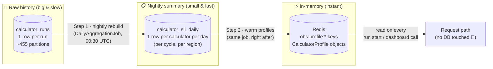
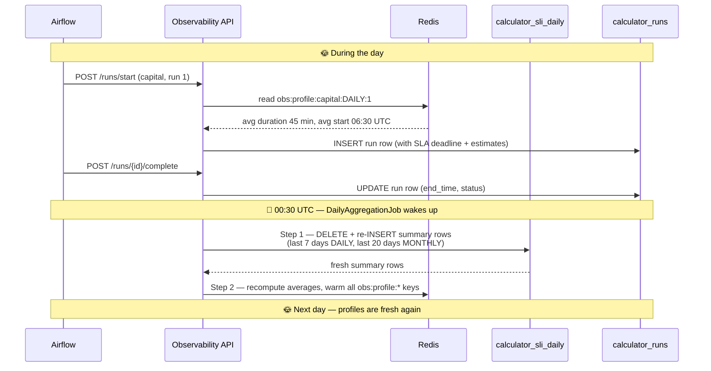
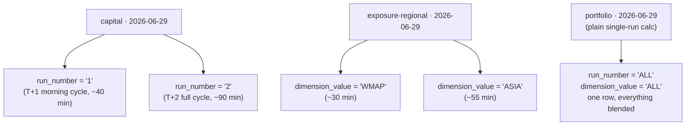
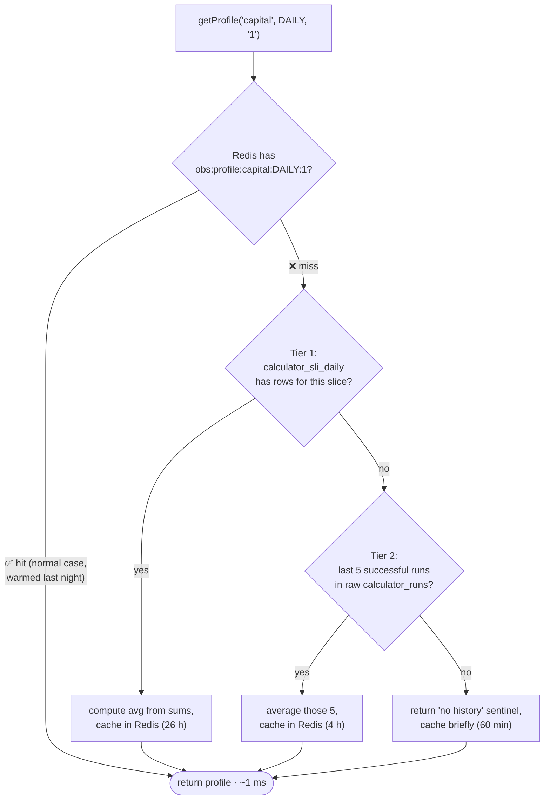
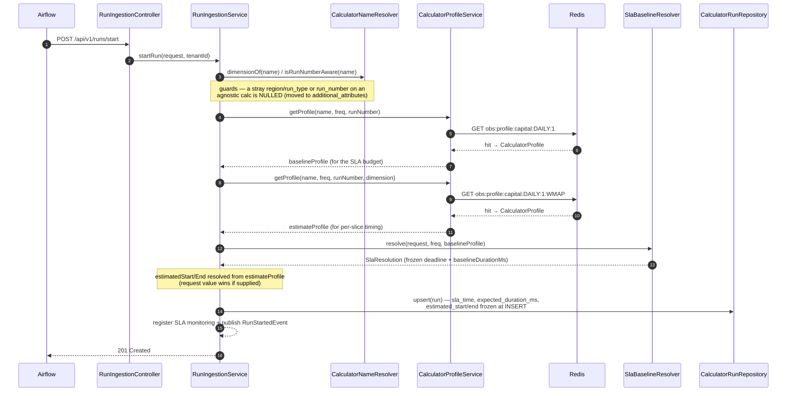
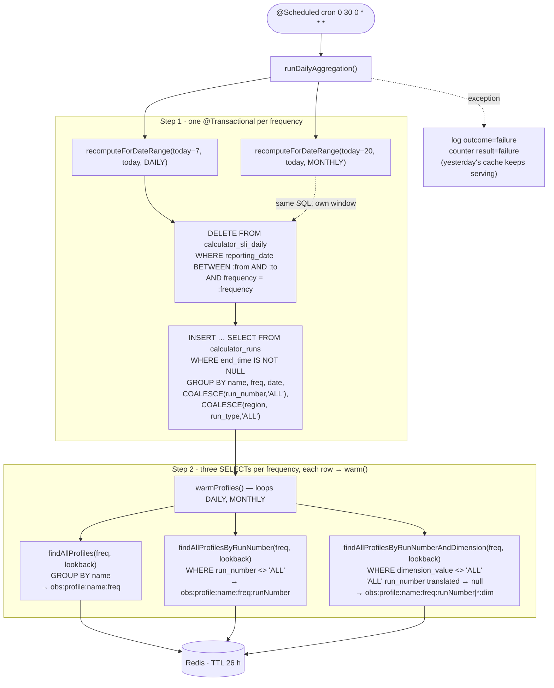
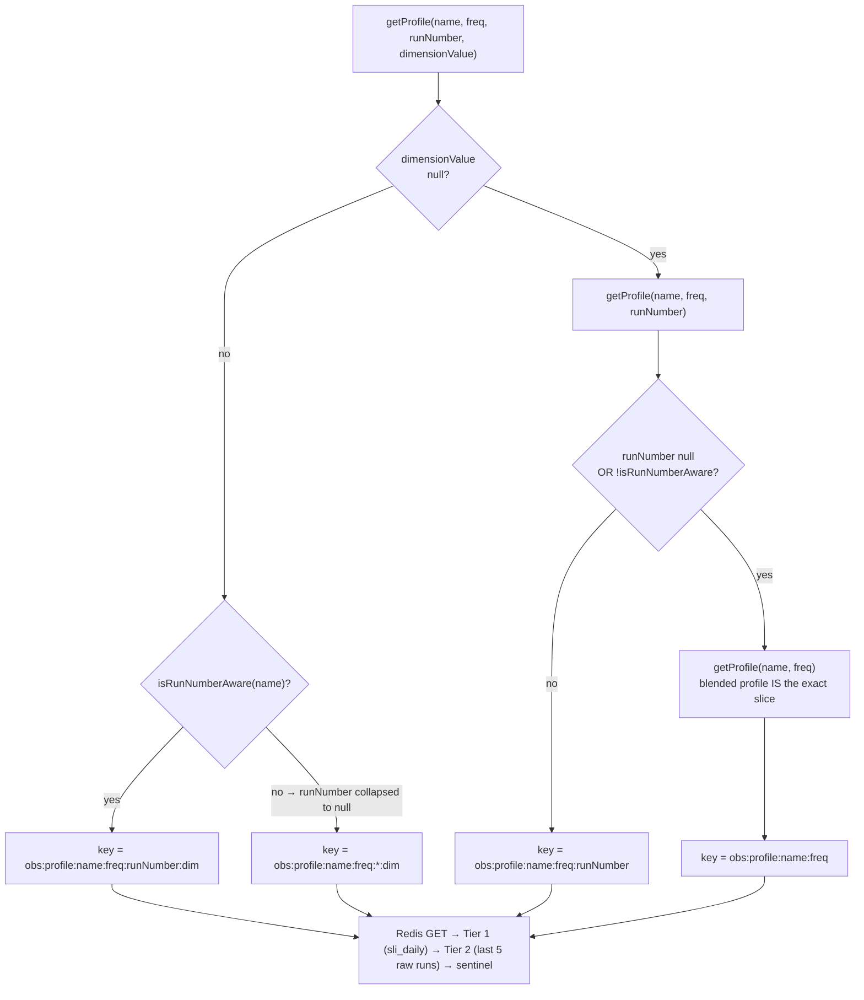

# Daily Aggregation — A Beginner's Guide

> **Who this is for:** anyone new to the Observability service who wants to understand
> what `DailyAggregate` / `calculator_sli_daily` is, when it gets written, and who reads it.
> No prior knowledge assumed. For the full technical contract, see
> [daily-aggregation-spec.md](daily-aggregation-spec.md).

---

## 1. The problem, in plain words

The Observability service watches **calculators** — batch jobs (run by Airflow) that
compute things like capital or portfolio numbers every day or every month.

Whenever a calculator run **starts**, the service immediately needs to answer two questions:

1. **"How long does this calculator *usually* take?"** — so it can set an SLA deadline
   ("if it's not done by then, raise an alert").
2. **"When should it start and finish?"** — so the dashboard can show *estimated*
   times, even for runs that haven't started yet.

Both answers come from **history**: the average of past runs.

The history lives in a big table called `calculator_runs` — one row per run, split into
hundreds of partitions by date. Scanning it to compute an average **on every request**
would be slow. So the service does what every good kitchen does: **prep the night before**.

> 🍳 **Analogy:** a restaurant doesn't grind spices when you order. Every night the prep
> cook makes a small jar of ready spice mix. During service, the chef just grabs the jar.
>
> - `calculator_runs` = the raw pantry (huge, slow to dig through)
> - `calculator_sli_daily` = the prep table (small, tidy, one summary row per day)
> - Redis profiles = the jar on the shelf right next to the stove (instant)

---

## 2. The three layers at a glance



| Layer | What it holds | Written by | Read by |
|---|---|---|---|
| `calculator_runs` | Every individual run (start, end, status…) | Airflow via `POST /runs/start` + `/complete` | The nightly job (and a few live queries) |
| `calculator_sli_daily` | One **summary row per calculator per reporting date** — counts and *sums* | **Only** `DailyAggregationJob` (nightly, 00:30 UTC) | `CalculatorProfileService` on a cache miss |
| Redis `obs:profile:*` | Tiny `CalculatorProfile` objects (avg duration, avg start/end time) | The nightly job (warm) + lazy fill on miss | Every run start and dashboard request |

**Key fact:** nothing writes `calculator_sli_daily` when a run completes. There is exactly
**one writer** — the nightly job. (It used to be updated on every completion; that caused a
race condition and was removed — tech debt TD-3, now resolved.)

---

## 3. When does everything happen? (a day in the life)



So the cycle is:

1. **All day:** runs are recorded in `calculator_runs`. The summary table is *not* touched.
2. **00:30 UTC:** the job **rebuilds** the recent slice of `calculator_sli_daily` from
   scratch, then **pushes fresh averages into Redis**.
3. **All next day:** every run start and dashboard call reads the warm Redis profile.
   The database is not queried on the hot path.

### Why "rebuild" instead of "add up as we go"?

The job **deletes** the recent window and **re-inserts** it every night. That sounds
wasteful but buys two big properties:

- **Idempotent** — running it twice gives the same result. Safe to re-run anytime.
- **Self-healing** — a run that finished *late* (after last night's pass) is simply
  picked up tonight. No manual fixing.

The rebuild window is sized per frequency:

| Frequency | Rebuilt window | Why that size |
|---|---|---|
| DAILY | last **7** days | A daily run can complete up to T+2 *business* days after its reporting date — across a weekend that's ~4 calendar days. 7 gives margin. |
| MONTHLY | last **20** days | A month-end run (e.g. for `2026-01-31`) actually executes in the *first half of February*. 20 days covers that lag. |

Once a reporting date falls out the back of its window, its summary row is **frozen** —
it never changes again (which is fine, because its runs are all long finished).

---

## 4. What does a row in `calculator_sli_daily` actually look like?

One row = *"for calculator X, on reporting date D, in cycle C and slice S — here are the
totals."* The important trick: it stores **sums, not averages**.

**Example.** On `2026-06-29`, the `capital` calculator's run-1 cycle ran 3 times
(a rerun happened), taking 40, 45 and 50 minutes:

| column | value | meaning |
|---|---|---|
| `calculator_name` | `capital` | which calculator |
| `frequency` | `DAILY` | daily or monthly |
| `reporting_date` | `2026-06-29` | the business date |
| `run_number` | `'1'` | the T+1 cycle (`'ALL'` for calculators that don't use cycles) |
| `dimension_value` | `'ALL'` | region or run-type slice (`'ALL'` = no slicing) |
| `total_runs` | `3` | how many runs completed |
| `success_runs` | `3` | how many succeeded |
| `sla_breaches` | `0` | how many missed their SLA |
| `sum_duration_ms` | `8 100 000` | 40+45+50 min = 135 min = 8.1 M ms — a **sum** |
| `sum_start_min_utc` | `1 170` | sum of start times as minutes-past-midnight |
| `sum_end_min_utc` | `1 305` | same for end times |

### Why sums? (the one clever idea in the whole design)

Averages **don't add up** — you can't combine "avg 45 min over 3 runs" and "avg 60 min
over 1 run" without knowing the counts. **Sums do add up.** So the table stores sums,
and the average is computed at read time over *any* window you like:

```
avg duration over last 30 days = SUM(sum_duration_ms) / SUM(total_runs)   ← exact, always
```

**Worked example** — building the `capital` run-1 profile from three daily rows:

| reporting_date | total_runs | sum_duration_ms |
|---|---|---|
| 2026-06-27 | 1 | 2 400 000 (40 min) |
| 2026-06-28 | 2 | 5 400 000 (44 + 46 min) |
| 2026-06-29 | 3 | 8 100 000 (40 + 45 + 50 min) |
| **totals** | **6** | **15 900 000** |

Profile average = 15 900 000 / 6 = **2 650 000 ms ≈ 44 min**. That's the number the
service uses as "this calculator usually takes ~44 minutes."

---

## 5. Cycles and regions: why one calculator can have many rows

Some calculators are more complicated than one-run-per-day, and the table's primary key
grows a row for each combination:



Why bother? Because **a blended average would lie**:

- `capital` run 1 takes ~40 min but run 2 takes ~90 min. A blended "~65 min" estimate
  would be wrong for *both*. Keeping separate rows means a run-1 start gets a run-1 deadline.
- A regional calculator's ASIA leg may take twice as long as WMAP. Per-region rows give
  per-region estimates on the dashboard.

Two simple rules keep this honest:

1. **One run, one bucket.** Every run is counted exactly once. A run without a
   `run_number` goes to the `'ALL'` bucket — it is never copied into cycle buckets.
2. **Only calculators declared cycle-aware** (config
   `observability.calculator.run-number-aware`, e.g. `capital`) get per-cycle rows *read
   back* as per-cycle profiles. For everyone else, the blended `'ALL'` profile is used —
   even if a client asks for "run 1".

---

## 6. Reading it back: the Redis profile lookup

The request path never talks to `calculator_sli_daily` directly — it asks
`CalculatorProfileService.getProfile(...)`, which tries three things in order:



Each profile carries a **confidence tag** so callers know how much to trust it:

| Tag | Means | Typical situation |
|---|---|---|
| `EXACT` | Plenty of samples from the summary table | A mature calculator — the normal case |
| `SPARSE_EXACT` | Right slice, but only a few samples | Calculator onboarded ~a week ago |
| `RECENT_EXACT` | No summary rows yet — averaged the last 5 raw runs live | Calculator onboarded *today* |
| (0 samples) | No history at all | First-ever run; SLA falls back to other sources |

And it's deliberately unbreakable: **if Redis is down, it falls back to the DB; if that
fails too, it returns the zero-sample sentinel. It never throws** — a profile problem can
never fail a run-start request.

### Who actually calls `getProfile`?

| Caller | Uses the profile to… |
|---|---|
| `RunIngestionService` (`POST /runs/start`) | Set the **SLA deadline** and **estimated start/end** when the request didn't supply them |
| `CalculatorStateService` (`GET /batch/runs`) | Show **estimated timing for NOT_STARTED runs** on the dashboard |
| `ExpectedRunsService` | Per-region / per-run-type expected timing when a batch is only partially done |
| `AnalyticsService` (`GET /executions`) | Fill in `expectedDurationMs` for actual-vs-expected comparison |

---

## 7. Developer flows — the same story with real class names

The sections above explain the *what*; these diagrams show the *where in the code*,
so you can follow along in the IDE or set a breakpoint.

### 7.1 Run start, end-to-end (the hot read path)

This is `RunIngestionService.startRun()` — where profiles are actually consumed.
Note that it fetches **two** profiles with different scopes:



Why two profiles? The **SLA budget** is scoped by `run_number` only (a RUN1 cycle has a
different budget than RUN2, but the budget is calculator-wide across regions), while the
**start/end estimates** are scoped down to the dimension (ASIA legitimately starts and
ends later than WMAP). See [RunIngestionService.java:124-127](../src/main/java/com/company/observability/service/RunIngestionService.java#L124-L127).

### 7.2 Inside the nightly job (the write path)

`DailyAggregationJob.runDailyAggregation()` with the actual repository methods:



Two details worth knowing when you read the code:

- The two `recomputeForDateRange` calls overlap on `[today−7, today]`, but each filters
  `frequency = :frequency` on both the DELETE and the INSERT — disjoint partitions, no
  double-processing ([DailyAggregationJob.java:69-72](../src/main/java/com/company/observability/scheduled/DailyAggregationJob.java#L69-L72)).
- Tier B/C **exclude the `'ALL'` bucket** — un-numbered history is already served by the
  blended Tier-A key. Tier C translates a leftover `'ALL'` run_number back to `null` so
  the warmed key matches the key the read path will compute ([DailyAggregateRepository.java:384-394](../src/main/java/com/company/observability/repository/DailyAggregateRepository.java#L384-L394)).

### 7.3 `getProfile` overload routing (the part that surprises people)

`CalculatorProfileService` has three overloads that delegate downward, and the routing
depends on whether the calculator is declared **run-number-aware** in config:



The practical consequence: calling `getProfile("portfolio", DAILY, "1")` for a calc that
is *not* in `observability.calculator.run-number-aware` does **not** return an empty
run-1 slice — it silently (and correctly) routes to the blended profile. This defends
`/batch/runs`, where `run_number` is client-supplied
([CalculatorProfileService.java:74-80](../src/main/java/com/company/observability/service/CalculatorProfileService.java#L74-L80)).

### 7.4 Redis key anatomy

```
obs:profile:capital:DAILY              ← Tier A · blended (also the null-runNumber route)
obs:profile:capital:DAILY:1            ← Tier B · run_number-scoped (aware calcs only)
obs:profile:capital:DAILY:1:WMAP       ← Tier C · run_number + dimension
obs:profile:exposure:DAILY:*:ASIA      ← Tier C · dimension only ('*' = no/collapsed runNumber)
            └─name──┘ └freq┘ │  └dim┘
                          runNumber
```

Canonical mapping across the three layers — this is the invariant that keeps warm keys
and read keys aligned:

| `calculator_sli_daily` | `CalculatorProfile` | Redis key segment |
|---|---|---|
| `run_number = 'ALL'` | `runNumber = null` | *(absent)* or `*` before a dim |
| `run_number = '1'` | `runNumber = "1"` | `:1` |
| `dimension_value = 'ALL'` | `dimensionValue = null` | *(absent)* |
| `dimension_value = 'WMAP'` | `dimensionValue = "WMAP"` | `:WMAP` |

---

## 8. Three end-to-end stories

### Story A — the boring (good) day

1. `capital` run 1 starts at 06:32 UTC. Redis has a warm `EXACT` profile: avg 44 min.
2. SLA deadline and estimated end (~07:16) are set instantly — **zero DB reads**.
3. The run completes at 07:10. ✅ On time.
4. That night at 00:30, the job re-rolls the last 7 days (today's run is now included)
   and re-warms the profile. Tomorrow's average has shifted by a few seconds. Repeat.

### Story B — a brand-new calculator

1. `fx-delta` is onboarded and runs for the first time on Tuesday.
2. At start: Redis miss → Tier 1 miss (no summary rows exist yet) → Tier 2 miss (no past
   runs either) → **zero-sample sentinel**. The SLA baseline falls back to whatever the
   start request supplied (e.g. an explicit `slaTime` or `expectedDurationMs`).
3. Tuesday's run completes. Wednesday morning at 00:30 the job aggregates it:
   `fx-delta` now has one summary row, and a `SPARSE_EXACT` profile (1 sample) is warmed.
4. After ~30 successful days it crosses the sample threshold and graduates to `EXACT`.

*(If it had run a few times before the first nightly pass, Tier 2 would already serve a
`RECENT_EXACT` profile averaged from those raw runs — no need to wait for the job.)*

### Story C — a run that finishes late

1. Monday's `portfolio` run hangs and only completes **Wednesday**.
2. Tuesday night's job already processed Monday's date — but Monday's row simply shows
   one fewer completed run (only finished runs are counted).
3. Wednesday night's job rebuilds the last 7 days *again*, and this time Monday's late
   run is inside — it lands in Monday's row automatically. **No one has to fix anything.**
4. The only limit: if a completion arrives more than 7 days (DAILY) / 20 days (MONTHLY)
   after its reporting date, its date has already frozen and it stays out of the summary.

---

## 9. What can go wrong, and what happens

| Situation | Behaviour |
|---|---|
| Redis is down at read time | Falls back to reading `calculator_sli_daily` directly. Slower, still correct. |
| Redis is down at write time | Warm/cache writes are logged and skipped. Never throws. |
| The nightly job crashes mid-run | Logged (`event=aggregation.daily outcome=failure`) + failure counter. Yesterday's Redis profiles keep serving (TTL is 26 h — long enough to survive one missed night). |
| The job is disabled (`observability.aggregation.daily.enabled=false`) | Profiles are built lazily on each cache miss. Correct but slower first hits. |
| A calculator had zero runs in the window | Its profile is a zero-sample sentinel, cached only 60 min — so once it becomes active it's picked up within the hour. |
| Backdated data loaded (dates older than the rebuild window) | The nightly job won't see it. Use the admin endpoint: `POST /api/v1/admin/aggregation/recompute?from=…&to=…` (ADMIN role) to aggregate an explicit range on demand. |

---

## 10. Cheat sheet

**The five invariants** (memorise these and you understand the system):

1. **Single writer** — only the nightly `DailyAggregationJob` writes `calculator_sli_daily`.
2. **Rebuild, don't increment** — delete + re-insert the window → idempotent & self-healing.
3. **Sums, not averages** — averages are computed at read time (`sum / total_runs`).
4. **One run, one bucket** — never double-counted across cycles.
5. **Reads never throw** — Redis → DB → zero-sample sentinel, in that order.

**Key knobs** (`application.yml`, prefix `observability.aggregation`):

| Key | Default | What it controls |
|---|---|---|
| `daily.enabled` | `true` | Master switch for the job |
| `daily.cron` | `0 30 0 * * *` | When it runs (00:30 UTC) |
| `recompute-window.daily-days` | `7` | DAILY rebuild window |
| `recompute-window.monthly-days` | `20` | MONTHLY rebuild window |
| `profile-cache-ttl-hours` | `26` | Redis TTL for normal profiles |

**Where to look when debugging:**

- Job code: [DailyAggregationJob.java](../src/main/java/com/company/observability/scheduled/DailyAggregationJob.java)
- The rebuild SQL: [DailyAggregateRepository.recomputeForDateRange](../src/main/java/com/company/observability/repository/DailyAggregateRepository.java)
- The read path: [CalculatorProfileService.java](../src/main/java/com/company/observability/service/CalculatorProfileService.java)
- Logs: `event=aggregation.daily` · Metrics: `obs.aggregation.*`, `obs.profile.cache`
- Deep dive: [daily-aggregation-spec.md](daily-aggregation-spec.md)
