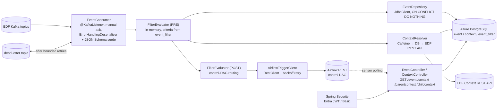

# Event Management Service (EMS) — Redesign Design & Implementation Plan

**Status:** Approved design, ready for implementation
**Date:** 2026-07-12
**Replaces:** event-orchestration (Scala 2.13 / Spring Boot, PostgreSQL JSONB-blob store)
**Companion:** [system_discovery.md](system_discovery.md) (current-state discovery)

---

## 1. Executive Summary

The event-orchestration microservice is the platform bottleneck: the query Airflow sensors use to fetch context-enriched events takes **10+ minutes**. The root cause is structural, not scale — `event` and `context` are opaque JSONB blobs with no secondary indexes, so every filtered query is a full sequential scan, and the event→context join runs on a JSONB extraction that cannot use the context primary-key index. At the actual read rate (≤ 1 QPS from deferrable sensors) this is a per-query-plan problem, not a throughput problem.

This document specifies a **from-scratch rewrite in Java 17 + Spring Boot 3.x** against **Azure Database for PostgreSQL**, with a redesigned schema that promotes the known hot filter attributes to typed, indexed, **generated** columns while keeping the JSONB payload as the source of truth. The component architecture is deliberately preserved — this is a **re-platform, not a re-architecture** — and the HTTP API contract is unchanged so Airflow (framework + ~85 DAGs) is untouched.

Expected outcome: enriched-event queries drop from 10+ minutes to low single-digit milliseconds; the store gains a lifecycle (retention/archival); the service moves to a maintainable mainstream stack.

---

## 2. Current-State Critical Review (what we are fixing, and why)

| # | Finding | Consequence |
|---|---------|-------------|
| 1 | No secondary indexes on any JSONB attribute (`taskId`, `datasetId`, `reporting-date`, `frequency`, `h3Region`, …) | Every API query is O(table size): full seq scan + per-row JSONB detoast/parse → 10+ min queries |
| 2 | Join on `event.json->>'context-id' = context.context_id` | JSONB extraction on the join key defeats the context PK index; forces hash/merge joins over full scans |
| 3 | 10-min queries × 300 s sensor polls × HikariCP max 40 | Queries arrive faster than they finish → connection-pool exhaustion cascade; no `statement_timeout` guardrail exists |
| 4 | No ingest timestamp, no retention, no partitioning strategy decision | Unbounded growth compounds scan cost; no archival story |
| 5 | Scala 2.13 on Spring Boot | None of Scala's strengths (no FP ecosystem use), all of its costs: hiring pool, compile times, Scala-3 migration blocked by Spring friction |
| 6 | HikariCP 40 max × 10 pods = 400 potential connections | Oversized vs Azure PG connection slots and vs actual load (~10/pod suffices) |
| 7 | `system_properties` DB-driven config bootstrapping (`DbConfigurationPostProcessor`) | Non-standard config indirection; complicates startup and environment promotion |
| 8 | Raw versioned SQL files, no migration tool | No repeatable, auditable schema lifecycle |

**What is sound and is deliberately preserved (anti-over-engineering):**

- Component flow: listener → pre-filter → persist → context resolution → post-filter → Airflow trigger; query API polled by sensors.
- `INSERT … ON CONFLICT DO NOTHING` dedup for Kafka at-least-once redelivery.
- JSONB as the payload of record (upstream schema can evolve without migrations).
- Idempotent Airflow triggering (deterministic `dag_run_id`, HTTP 409 = success).
- K8s/Helm/Istio/HPA deployment model, Workload Identity.

---

## 3. Decision Record

| Decision | Choice | Rationale | Rejected alternatives |
|----------|--------|-----------|----------------------|
| Language/runtime | **Java 17 LTS** (org-standard runtime; blocking servlet model on platform threads) | Same JDK the current service already runs (`openjdk:17` image) → zero runtime novelty in the port; EDF contract ships as a JVM artifact (`com.ubs.edf.coreservice.api.v2.EventResponse`) → compile-time contract safety; enterprise hiring pool. Blocking model is fine at this concurrency (≤ 1 QPS reads, modest event volume — default Tomcat pool is orders of magnitude above the load); virtual threads (Java 21) add nothing here, and moving to 21 later is a build-config change since Spring Boot 3.x supports both | Scala-native (ZIO/http4s): expertise-heavy, unjustified. Kotlin: fine variant, adds novelty without need. **Python/FastAPI**: wins only on team unification with Airflow codebase; loses on Kafka consumer framework maturity (hand-rolled retry/DLT/ack plumbing), runtime-only typing, and full reset of security/ops config |
| Framework | **Spring Boot 3.5.x** | Spring Kafka is a consumer *framework* (error-handling deserializer, backoff retry, dead-letter publishing, lifecycle) — not just a client; security (Entra JWT), actuator, Helm wiring carry over ~1:1 | Reactive/WebFlux: complexity with no payoff at this concurrency |
| Persistence access | **`JdbcClient`, no ORM** | Matches current (correct) choice; queries are few and hand-tuned | JPA/Hibernate: nothing to gain, plan opacity to lose |
| Schema strategy | **Typed `GENERATED ALWAYS … STORED` columns from JSONB + composite B-tree indexes; JSONB remains source of truth** | Zero write-path coupling; columns can never drift from payload; backfill is automatic during data load | Expression indexes only: fragile query↔index text coupling, no typed columns, acceptable only as emergency hotfix. Full normalization: brittle vs upstream schema evolution, big rewrite, no additional benefit at this scale |
| Partitioning | **Not now — deferred with explicit triggers** | Partitioning `event` forces the partition key into the PK → unique-on-`event_id` is lost → `ON CONFLICT (event_id)` dedup **breaks**. At a few GB, pruning adds nothing over the indexes; retention is a cheap batched DELETE. **Revisit if:** table > ~50 GB or monthly delete/vacuum churn becomes measurable | Range partitioning by month |
| Caching | **In-process Caffeine only**: context-by-id (ingestion fetch-dedup) + filter criteria (60 s refresh). **No enriched-event/query caching. No Redis** | Sensors poll `/event` to detect state change — caching that endpoint serves stale 404s and delays DAG completion by the TTL. Post-redesign reads are low-ms at ≤ 1 QPS: no DB load to relieve. Redis = network hop + failure mode + ops dependency for nothing | Azure Cache for Redis (available, deliberately unused; revisit only for a genuine cross-pod need) |
| Filter criteria storage | **PostgreSQL table `event_filter`, evaluated in memory** | Operational data (changes with calculator onboarding) → no redeploys; structured + auditable; Flyway-seeded | Config files (redeploy per change); rules engines/SpEL/Drools (over-engineering — flat AND-of-equals covers all known patterns) |
| Migrations | **Flyway** | Repeatable, auditable, CI-enforced; replaces raw SQL folder | Liquibase (either fine; Flyway simpler for SQL-first teams) |
| Config | **Standard Spring profiles + env vars (Helm/Vault), retire `system_properties` indirection** | Removes bootstrap complexity; K8s-native | Keeping DB-driven config (audit its contents first — see §14 Open Items) |
| DB platform | **Azure Database for PostgreSQL Flexible Server**, zone-redundant HA, Entra ID (Workload Identity) passwordless auth | Managed, already provisioned; credentials disappear from config | — |

---

## 4. Target Architecture

### 4.1 Component view



### 4.2 Ingestion pipeline (normative)

1. **Consume** — Spring Kafka `@KafkaListener` on the EDF topics; `AckMode.MANUAL_IMMEDIATE`; `isolation.level=read_committed`; `ErrorHandlingDeserializer` wrapping the Confluent JSON Schema deserializer for `EventResponse` (a malformed message must never kill the consumer).
2. **Pre-filter** — evaluate `PRE`-stage criteria (in-memory, §7). Non-matching events are acked and dropped **without being persisted** (intentional; matches current behavior; counted in metrics). Caveat: a misconfigured `event_filter` PRE row silently discards events, recoverable only by offset replay within the Kafka topic's retention window — treat PRE-criteria changes as reviewed production changes, and alert on an abnormal filtered-out rate.
3. **Persist event** — `INSERT INTO event (event_id, json) VALUES (?, ?::jsonb) ON CONFLICT (event_id) DO NOTHING`. Generated columns populate automatically. A conflict (redelivery) is a silent no-op — processing continues (trigger is idempotent, so re-running steps 4–5 is safe).
4. **Resolve context** — by `context-id` from the event: Caffeine cache hit → done; else DB PK lookup → cache and done; else **call the EDF Context REST API** (`RestClient`, OAuth2 client-credentials via Entra, bounded exponential-backoff retry), persist to `context` (`ON CONFLICT DO NOTHING`), cache. Contexts are immutable → fetch-once semantics.
5. **Post-filter + trigger** — evaluate `POST`-stage criteria; on match, build `EnrichedEvent(event, context)` (shape identical to today, see system_discovery.md) and `POST /dags/{dagId}/dagRuns` with exponential backoff on 429/5xx. Then **ack**.

**Failure semantics (no-loss by construction):** any step failing throws → record is **not acked** → Spring Kafka `DefaultErrorHandler` handles it by **exception classification**:

- **Poison — can never succeed** (deserialization failure, contract violation): after a few quick attempts, publish to the dead-letter topic (`<topic>.DLT`) and ack. The DLT publish is **verified before the offset commits** — `DeadLetterPublishingRecoverer` with `failIfSendResultIsError=true` and a DLT producer using `acks=all`. A failed DLT publish leaves the offset uncommitted, so the record is redelivered rather than lost.
- **Transient infrastructure — will succeed later** (Azure PG / EDF API / Airflow connectivity): **unbounded exponential backoff** (seek-based retry, so `max.poll.interval.ms` is never tripped and no rebalance storm occurs). The partition parks until the dependency recovers; nothing is dropped and nothing reaches the DLT; consumer-lag alerting surfaces the stall. This deliberately replaces "N retries → DLT" for infra errors: parking a partition is recoverable, parking messages in a DLT during an outage is business-level loss until someone replays them.

Trade-off (accepted): an extended dependency outage stalls the affected partitions — by design. Because event insert, context insert, and Airflow trigger are all idempotent, at-least-once redelivery is safe end-to-end: a crash or rebalance between **any** two steps (including between DB write and ack) produces a duplicate, never a loss.

**DLT replay runbook:** DLT records carry original topic/partition/offset and exception headers (`DeadLetterPublishingRecoverer` defaults). On DLT-depth alert: fix the root cause (usually an upstream contract change), then replay by re-publishing DLT records to the source topic via the ops replay script — idempotency makes replay safe even for partially processed records. The DLT is a triage queue, never a graveyard: every alerted record ends in replay or a documented discard decision.

### 4.3 Query API (contract preserved — Airflow untouched)

| Endpoint | Semantics (unchanged) | Filter params → columns |
|----------|----------------------|--------------------------|
| `GET /event` | **200 + enriched event if found, 404 if not** (sensor contract — must be exact) | `taskId→event.task_id`, `datasetId→event.dataset_id`, `source→event.source`, `state→event.state`, `type→event.event_type`, `context-id→event.context_id`, `reporting-date→context.reporting_date`, `frequency→context.frequency`, `h3Region→context.h3_region`, `limit→LIMIT` |
| `GET /context` | context lookup | `datasetId→context.dataset_id`, `context-id→context.context_id`, `reporting-date`, `frequency` |
| `GET /parentcontext`, `GET /childcontext` | context-chain traversal | `initial-context-id→context.initial_context_id`, `context-id` |
| `POST /token`; dev/test `POST /listen`, `/listencontext`, `GET /statuschange` | as today | — |

Canonical enriched-event query (all filters optional, WHERE built from supplied params only):

```sql
SELECT e.json AS event, c.json AS context
FROM event e
JOIN context c ON c.context_id = e.context_id
WHERE e.task_id = :taskId
  AND c.reporting_date = :reportingDate
  AND c.frequency = :frequency
  AND c.h3_region = :h3Region
ORDER BY e.created_at DESC
LIMIT :limit;
```

Expected plan: Index Scan on `idx_event_task_id` → nested-loop → context PK lookup. Response bodies are built from the `json` columns, so the wire format is byte-compatible with today.

**Parameter aliases & value semantics (from observed sensor traffic — must be preserved exactly):**

| Incoming param (observed) | Column | Notes |
|---|---|---|
| `contextId`, `context-id`, `triggerContextId` | `event.context_id` | alias set: VERIFY complete inventory in sensor code |
| `parent_id` | `context.parent_context_id` | STATUS CHECK driver; VERIFY parent-vs-initial field model (§14) |
| `DATASET_UUID`, `datasetId` | `dataset_id` | |
| `FREQUENCY`, `frequency` | `context.frequency` | |
| `LBD`, `reporting-date` | `context.reporting_date` | VERIFY: `LBD` may instead map to `event.business_date` (§14) |
| `TYPE`, `type` | `event.event_type` | |
| `STATE`, `state` | `event.state` | **multi-value alternation supported** (`FINISH\|FAILED`) → bind as `state = ANY(:values)` — still index-friendly since state is always a residual filter |
| `taskEventType` | `event.task_event_type` | |

Contract rules: param names matched **case-insensitively**; date-valued params **normalized to the canonical stored text format** before binding (observed `20260710` compact form vs. whatever format production JSON stores — text equality demands one canonical form; normalization lives in the controller, never in SQL).

**Auth:** Spring Security OAuth2 resource server (Entra JWT + group claims) with Basic fallback, mirroring current `AuthorizationManager` modes.

---

## 5. Data Model (Flyway `V1__create_event_context.sql`)

Design rules: every promoted column is **plain `text` extracted verbatim — no casts** in generated expressions. A `::uuid`/`::date` cast would make one malformed message poison all inserts, and `text::date` is not `IMMUTABLE` anyway. ISO-8601 dates compare and sort correctly as text. `NULL` results from absent JSON keys are expected and fine.

```sql
CREATE TABLE event (
    event_id      text PRIMARY KEY,
    json          jsonb NOT NULL,
    task_id       text GENERATED ALWAYS AS (json->>'taskId') STORED,
    dataset_id    text GENERATED ALWAYS AS (json->'additionalData'->>'datasetId') STORED,
    context_id    text GENERATED ALWAYS AS (json->>'context-id') STORED,
    source        text GENERATED ALWAYS AS (json->>'source') STORED,
    state         text GENERATED ALWAYS AS (json->>'STATE') STORED,
    event_type    text GENERATED ALWAYS AS (json->'additionalData'->>'type') STORED,
    task_event_type text GENERATED ALWAYS AS (json->>'taskEventType') STORED,
    business_date text GENERATED ALWAYS AS (json->>'businessDate') STORED,
    created_at    timestamptz NOT NULL DEFAULT now()
);

CREATE TABLE context (
    context_id         text PRIMARY KEY,
    json               jsonb NOT NULL,
    dataset_id         text GENERATED ALWAYS AS (json->>'datasetId') STORED,           -- path: VERIFY §14
    reporting_date     text GENERATED ALWAYS AS (json->'data'->>'reporting-date') STORED,
    frequency          text GENERATED ALWAYS AS (json->'data'->>'frequency') STORED,
    h3_region          text GENERATED ALWAYS AS (json->'data'->>'h3Region') STORED,
    initial_context_id text GENERATED ALWAYS AS (json->>'initial-context-id') STORED,  -- path: VERIFY §14
    parent_context_id  text GENERATED ALWAYS AS (json->>'parent-context-id') STORED,   -- path: VERIFY §14 — confirm parent vs initial are distinct fields; drop this column if they are one and the same
    created_at         timestamptz NOT NULL DEFAULT now()
);
```

## 6. Indexes (Flyway `V2__indexes.sql`)

Driven strictly by the stated access patterns; nothing speculative.

```sql
-- event: taskId is THE calc-event lookup key; context_id serves the join;
-- dataset_id secondary; created_at serves retention + ORDER BY
CREATE INDEX idx_event_task_id    ON event (task_id);
CREATE INDEX idx_event_dataset_id ON event (dataset_id);
CREATE INDEX idx_event_context_id ON event (context_id);
CREATE INDEX idx_event_created_at ON event (created_at);

-- context: reporting-date + frequency are almost always paired; h3_region rides
-- as 3rd column. Leftmost-prefix serves pair-only queries — one index, not three.
CREATE INDEX idx_context_rep_freq_region ON context (reporting_date, frequency, h3_region);
CREATE INDEX idx_context_dataset_id      ON context (dataset_id);
CREATE INDEX idx_context_initial_ctx     ON context (initial_context_id);
CREATE INDEX idx_context_parent_ctx      ON context (parent_context_id);  -- STATUS CHECK driver; drop with the column if parent == initial
CREATE INDEX idx_context_created_at      ON context (created_at);
```

Low-frequency / always-companioned params (`source`, `type`, `state`, `taskEventType`) get **no dedicated indexes**: in every observed query they co-occur with a selective key (context-id, parent-context-id, task/dataset, date+frequency), so the driving index narrows to a handful of rows and the residual filter is free. Add later only if `pg_stat_statements` proves a need.

**Observed sensor queries → expected drivers** (validation targets for the §12 `EXPLAIN` assertions):

| Observed query (params) | Driving index | Residual filters |
|---|---|---|
| DATASET CHECK: `contextId, DATASET_UUID, FREQUENCY, LBD, source, TYPE` | `idx_event_context_id` (or `idx_event_dataset_id` when no contextId) | source, event_type, frequency, reporting_date |
| START-EVENT LINK: `triggerContextId, taskEventType` | `idx_event_context_id` | task_event_type |
| STATUS CHECK: `parent_id, type, STATE (multi-value)` | `idx_context_parent_ctx` → join `idx_event_context_id` | event_type, state |

## 7. Filter Criteria (Flyway `V3__event_filter.sql`)

Replaces the opaque `post_filter_control_dag_map` and absorbs the pre-filter predicate currently hardcoded in `EventFilter.scala`.

```sql
CREATE TABLE event_filter (
    id          bigint GENERATED ALWAYS AS IDENTITY PRIMARY KEY,
    stage       text NOT NULL CHECK (stage IN ('PRE', 'POST')),
    dag_id      text,                                   -- POST only: control DAG to trigger
    criteria    jsonb NOT NULL,                         -- flat map: attribute -> value | [values]
    enabled     boolean NOT NULL DEFAULT true,
    description text,
    updated_at  timestamptz NOT NULL DEFAULT now(),
    updated_by  text NOT NULL,
    CONSTRAINT post_requires_dag CHECK (stage <> 'POST' OR dag_id IS NOT NULL)
);

-- Seed example (real rows migrated from post_filter_control_dag_map — see §14):
INSERT INTO event_filter (stage, dag_id, criteria, updated_by, description) VALUES
  ('PRE',  NULL,          '{"source": ["MEG", "MERIVAL"]}',                    'flyway-seed', 'retain only calculator lifecycle events'),
  ('POST', 'control_dag', '{"state": "FINISHED", "type": ["CALC_COMPLETE"]}',  'flyway-seed', 'route completed calc events to control DAG');
```

**Evaluation semantics (normative):** a criteria object matches an event when **every** key matches (AND). A key matches when the event/context attribute equals the value, or is a member of the value array (IN). Keys resolve against the promoted attribute names (`task_id`, `dataset_id`, `source`, `state`, `event_type`, `business_date`, `reporting_date`, `frequency`, `h3_region`). A `POST` match yields the row's `dag_id`; multiple matches yield multiple triggers (same as today's map). No negation/OR/regex until a real case demands it.

**Runtime:** `FilterCriteriaService` loads enabled rows into a Caffeine cache with `refreshAfterWrite(60 s)` — per-event evaluation is pure in-memory; zero hot-path DB reads; criteria changes take effect within a minute without redeploys.

## 8. Caching (complete list — nothing else is cached)

| Cache | Scope | Key | TTL / size | Purpose |
|-------|-------|-----|------------|---------|
| Context | in-process Caffeine | `context_id` | 24 h / 10 000 | Ingestion fetch-dedup: skip EDF API call + DB hit for events sharing a context. Safe because contexts are immutable (verify — §14) |
| Filter criteria | in-process Caffeine | all enabled rows | refresh 60 s | Zero hot-path DB reads for filter evaluation |

**Explicitly no enriched-event or query-result caching** and **no Redis** — see Decision Record §3 (stale-404 hazard on a state-change-polling endpoint; no load to relieve).

---

## 9. Retention & Archival (~13 months online, archive to blob)

A monthly **Airflow maintenance DAG** (the team already operates Airflow; zero new infrastructure):

1. **Archive**: export rows older than 13 months to compressed files in Azure Blob Storage:
   `COPY (SELECT * FROM event WHERE created_at < now() - interval '13 months') TO STDOUT` → gzip → blob (same for `context`).
2. **Delete events** in batches (PostgreSQL `DELETE` has no `LIMIT`; use the ctid pattern):

```sql
DELETE FROM event
WHERE ctid IN (
    SELECT ctid FROM event
    WHERE created_at < now() - interval '13 months'
    LIMIT 50000
);
-- loop until 0 rows affected; sleep between batches
```

3. **Delete orphaned contexts** — only contexts past retention **and** no longer referenced (respects `initial_context_id` chains via the surviving events):

```sql
DELETE FROM context c
WHERE c.created_at < now() - interval '13 months'
  AND NOT EXISTS (SELECT 1 FROM event e WHERE e.context_id = c.context_id);
```

(`idx_event_context_id` makes the `NOT EXISTS` cheap.) Autovacuum absorbs the monthly ~1/13 churn at this table size; no partitioning needed (§3).

---

## 10. Configuration & Deployment

| Concern | Setting |
|---------|---------|
| DB | Azure PG Flexible Server, zone-redundant HA; Entra ID / Workload Identity passwordless auth (Spring Cloud Azure JDBC plugin) |
| Pool | HikariCP `maximumPoolSize=10` per pod (was 40); `connectionInitSql` or datasource property sets `statement_timeout=30s` as a regression guardrail |
| Kafka | Same topics/group semantics; `SASL_SSL`; `enable.auto.commit=false` + `AckMode.MANUAL_IMMEDIATE`; **`auto.offset.reset=earliest`** (lost/expired group offsets must resume from oldest retained, never skip forward); `ErrorHandlingDeserializer`; `DefaultErrorHandler` with exception classification (§4.2): unbounded backoff for transient infra, verified-publish DLT (`acks=all`, `failIfSendResultIsError=true`) for poison |
| HTTP out | `RestClient`; Airflow trigger retry: 5 attempts, 30 s–600 s, jitter, on 429/5xx (port of `ExponentialBackoffRetryStrategy`); EDF context API retry: shorter/bounded (it blocks a partition) |
| K8s | Existing Helm chart pattern; HPA 3–10; actuator liveness/readiness; Istio; Vault; RollingUpdate maxSurge 1 / maxUnavailable 0 |
| Config | Spring profiles + env vars via Helm/Vault; `system_properties` retired (§14) |

**Observability (Micrometer → OpenTelemetry):** consumer lag; counters for consumed / pre-filtered-out / persisted / duplicate / context-cache-hit / EDF-fetch / post-filter-matched / triggered / DLT; latency histograms for EDF API, Airflow trigger, and each query endpoint; alerts on DLT depth > 0, consumer lag (with headroom tracked against topic retention — an outage outlasting retention is the one loss scenario no consumer config prevents), abnormal pre-filtered-out rate, and endpoint p95.

**Suggested package layout:**

```
com.<org>.ems
├── EmsApplication.java
├── config/          # kafka, security, datasource, cache, retry, azure
├── consumer/        # EventConsumer
├── filter/          # FilterCriteriaService, FilterEvaluator
├── edf/             # EdfContextClient (REST, OAuth2 client-credentials)
├── repository/      # EventRepository, ContextRepository, FilterRepository (JdbcClient)
├── enrich/          # EnrichmentService (EnrichedEvent assembly)
├── airflow/         # AirflowTriggerClient
├── api/             # EventController, ContextController, TokenController
└── model/           # records: EventRow, ContextRow, EnrichedEvent
```

---

## 11. Migration & Cutover Runbook (maintenance window; few GB → minutes)

**Pre-window (any time before):**
1. Resolve §14 open items (JSON paths, EDF API contract, filter-row semantics, PG version ≥ 12 — target ≥ 16).
2. Provision Azure PG; run Flyway V1–V3 in all environments; CI green.
3. Capture the **before** evidence: `EXPLAIN (ANALYZE, BUFFERS)` of the real production slow query + current p95.
4. Deploy EMS "dark": pods up, Kafka consumers stopped (container stopped via property), API reachable on a staging route.
5. Rehearse the full window on a production-sized copy; record timings.

**Window:**
6. Stop old service (scale to 0). Airflow sensors will simply get connection errors and re-poke — deferrable sensors tolerate this by design; in-flight runs are unaffected.
7. Copy the 13-month retention window from the old DB: `INSERT INTO event (event_id, json) SELECT event_id, json FROM old.event WHERE …` (via `postgres_fdw` or dump/restore). Generated columns compute automatically during load. Same for `context`. Seed `event_filter` from audited `post_filter_control_dag_map` rows.
8. `ANALYZE event, context;`
9. Start EMS consumers with the **same Kafka `group.id`** → inherits committed offsets; manual-ack semantics mean no loss; consumers catch up on the backlog accumulated during the window.
10. Smoke test: `/event` 200 & 404 paths, `/context`, `/parentcontext`, `/childcontext`; verify one end-to-end trigger against a test control-DAG mapping.
11. Repoint the Airflow-side endpoint config (`ES_EVENT_ENDPOINT` / ingress route) if the host changes; otherwise route flips at the ingress.

**Rollback:** old service and old DB remain untouched and startable throughout; cutback = scale old service up, repoint route, restart its consumers (same group.id — offsets still coherent because both services commit only after successful processing).

---

## 12. Testing Strategy & Acceptance Criteria

**Tests (CI-gated):**
- Unit: filter evaluation semantics (AND/IN, PRE vs POST, disabled rows), enrichment assembly, param→SQL builder.
- Integration (Testcontainers: PostgreSQL 16 + Kafka): full pipeline — publish `EventResponse` → assert row persisted, generated columns populated, context fetched (WireMock for EDF API), Airflow trigger called (WireMock), dedup on redelivery, DLT after poison message, **transient outage drill** (DB/EDF unavailable → record retried indefinitely, never dead-lettered, processed after recovery), **DLT-publish failure drill** (broker rejects DLT send → offset stays uncommitted, record redelivered).
- Contract: `/event` returns **byte-compatible** enriched JSON; exact 200/404 semantics under every param combination Airflow uses.
- Performance: seed 10 M synthetic events + 1 M contexts; assert the canonical query (§4.3) p95 **< 50 ms** and plan uses `idx_event_task_id` / `idx_context_rep_freq_region` (no seq scans) via `EXPLAIN` assertion.

**Acceptance checklist (gate for go-live):**
- [ ] Before/after `EXPLAIN (ANALYZE, BUFFERS)` recorded: seq-scan + hash-join → index nested-loop; 10+ min → low ms.
- [ ] Generated-column completeness: `SELECT count(*) FROM event WHERE task_id IS NULL` reconciles with rows genuinely lacking the key in JSON (same for all promoted columns).
- [ ] Dedup regression: re-insert existing `event_id` → silent no-op, no duplicate trigger observed.
- [ ] Sensor round-trip p95 < 1 s at 100 concurrent pollers.
- [ ] DLT alerting fires in staging drill; consumer-lag dashboard live.
- [ ] Retention DAG dry-run on staging copy: archive files land in blob, batch deletes complete, orphan-context rule leaves referenced contexts intact.

---

## 13. Work Breakdown (implementation order)

| Phase | Scope | Exit criterion |
|-------|-------|----------------|
| 0. Verification spike | Resolve all §14 open items against production data & EDF team | Open items table fully answered; DDL paths finalized |
| 1. Foundation | Repo scaffold, CI, Flyway V1–V3, Testcontainers harness, Helm skeleton | `flyway migrate` + integration harness green in CI |
| 2. Ingestion pipeline | Consumer, pre-filter, persistence, ContextResolver + EDF client, post-filter, Airflow trigger, DLT | Integration tests (incl. poison/redelivery) green |
| 3. Query API | Controllers, param→SQL builder, auth (Entra JWT + Basic), contract tests | Contract suite green vs recorded current responses |
| 4. Ops readiness | Metrics/alerts, dashboards, Helm finalization, perf test @10 M rows | Perf gate (< 50 ms p95) green; staging soak with replayed prod events |
| 5. Cutover | Runbook §11 rehearsal, then production window | Acceptance checklist §12 fully ticked |
| 6. Lifecycle | Retention/archival DAG + staging dry-run | Retention gate in §12 ticked |

---

## 14. Open Items — verify before Phase 1 completes (do not assume)

| # | Item | Impacts |
|---|------|---------|
| 1 | Exact JSON paths for `datasetId`, `initial-context-id`, and `parent-context-id` in **context** rows — and whether parent/initial are distinct fields or one (drop `parent_context_id` column + index if same) | V1 generated-column expressions; STATUS CHECK query driver |
| 1a | `LBD` param semantics: maps to `context.reporting_date` or `event.business_date`? Canonical stored date format vs observed compact param format (`20260710`) | §4.3 alias table; date normalization; possibly an index on `business_date` if it turns out to be the driver |
| 1b | Complete query-param alias inventory from orchestration sensor code (`BasicDatasetEventCriteriaTask`, `HttpDeferrableSensor` call sites) to freeze the §4.3 alias table | Controller param mapping; contract tests |
| 2 | EDF Context REST API: endpoint, auth flow, error contract, rate limits (dependency surfaced during design; absent from discovery doc) | `EdfContextClient`, retry policy |
| 3 | Current pre-filter logic in `EventFilter.scala` and all `post_filter_control_dag_map` rows | `event_filter` seed data; PRE criteria |
| 4 | Whether event JSON carries a usable ingest/emit timestamp | If yes: promote it instead of load-time `created_at` for historical rows |
| 5 | Context immutability guarantee from EDF | 24 h context cache validity |
| 6 | Azure PG version (need ≥ 12 for generated columns; target 16) | V1 DDL |
| 7 | Contents of `system_properties` (what config actually lives there) | Config migration to Helm/Vault |
| 8 | Long-term owning team (was the Java-vs-Python tiebreaker) | Staffing Phase 1+ |

---

*End of design. Flyway-ready SQL from §5–§7 should be lifted verbatim into `db/migration/` in the new service repository once §14 items 1, 3, 6 are confirmed.*
