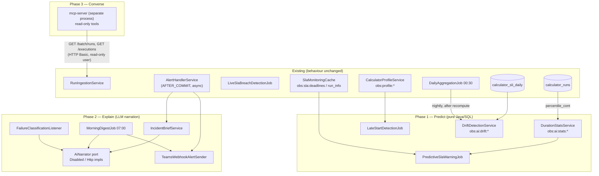
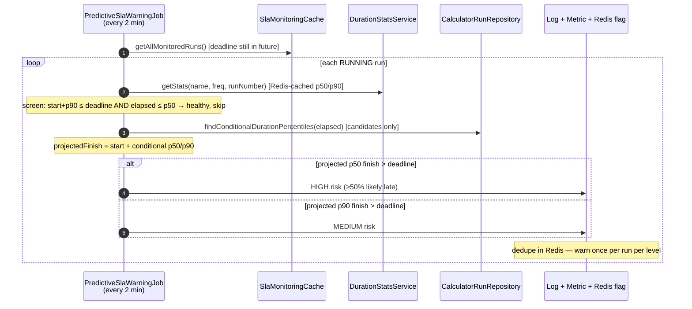
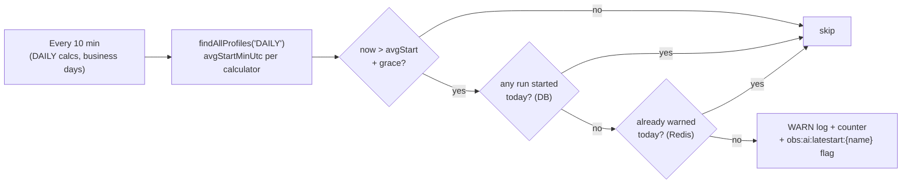
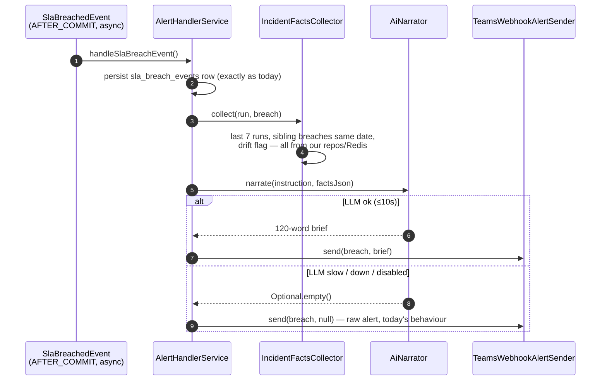
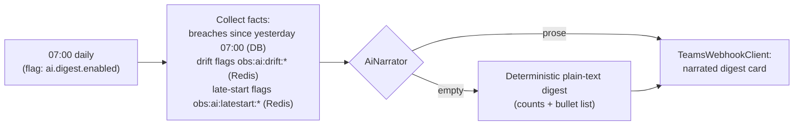

# AI Integration Implementation Plan

> **For Claude:** REQUIRED SUB-SKILL: Use superpowers:executing-plans to implement this plan task-by-task.

**Goal:** Implement the three-phase AI roadmap from `docs/AI_integration_ideas.md` — Phase 1 statistical prediction (no external AI), Phase 2 LLM-narrated alerts and digests, Phase 3 read-only MCP ops copilot.

**Architecture:** All AI attaches at the edges of the existing system — scheduled jobs, async AFTER_COMMIT listeners, and read-only API clients. The ingestion path (`/start`, `/complete`), SLA detection, and storage are untouched. Every feature ships dark behind an `observability.ai.*` feature flag (default **off**) and fails safe: if an AI component errors, the system behaves exactly as today.

**Tech Stack:** Java 17, Spring Boot 3.5.9, PostgreSQL 17 (`percentile_cont`), Redis (existing `StringRedisTemplate` patterns), Spring `RestClient` (Phase 2), TypeScript + MCP SDK (Phase 3, separate process).

---

## Part 0 — AI concepts primer (read this first — 10 minutes)

The team is new to AI integration. Here is every concept this plan uses, in the order you'll meet it:

| Concept | What it means here |
|---|---|
| **Statistical ML vs generative AI** | Phase 1 is *statistics* — percentiles and comparisons computed by PostgreSQL. No model, no vendor, fully explainable. Phases 2–3 use a *Large Language Model* (LLM) — a text-in/text-out service that writes prose. |
| **Percentile (p50/p90)** | Sort historical run durations; p50 (median) = half the runs finished faster; p90 = 90% finished faster. Percentiles resist outliers, unlike averages. |
| **Conditional probability** | "Given this run has already been going 40 minutes, what do runs *that were still going at 40 minutes* usually end up taking?" One SQL `WHERE duration_ms >= :elapsed` clause turns a plain percentile into a conditional one. This is the whole trick behind predictive warnings. |
| **Prompt** | The text instruction sent to an LLM. Ours always contain: a role ("you write incident briefs"), strict rules ("use ONLY these facts"), and a JSON block of facts computed by *our* SQL. |
| **Token** | LLM billing unit, ~¾ of a word. An incident brief is roughly 1,000 tokens in / 200 out — a fraction of a cent per breach at current frontier-model pricing (confirm against the approved provider's price sheet). |
| **Temperature** | LLM randomness knob, 0.0–1.0. We always use **0** (deterministic, factual) — never creative writing. |
| **Hallucination** | An LLM inventing facts. Our defence is architectural: the LLM never computes or retrieves numbers — it only rephrases a facts-JSON we hand it, and anything it says beyond those facts is discardable prose, never data. |
| **MCP (Model Context Protocol)** | An open standard that lets an AI assistant (e.g. Claude) call your APIs as "tools". Phase 3 wraps our two read-only GET endpoints as MCP tools — the AI can *ask* our service questions but can never write. |

**The one rule that keeps this safe:** numbers travel DB → JSON → prose, never the other way. No AI output is ever written back as a metric, deadline, or status — the single exception is Phase 2's failure *category*, which is validated against a fixed whitelist before persisting.

---

## Assumptions I'm making

1. Phase 2/3 LLM provider selection and API key provisioning is an org decision that happens **before** Task 10 — the code is provider-agnostic behind one interface; only `HttpAiNarrator` internals adapt.
2. `observability.sla.live-tracking.enabled` will be `true` in any environment where Phase 1 prediction is wanted (prediction reads the `obs:sla:*` structures that live tracking maintains). Base `application.yml` currently has it `false`.
3. A Teams incoming-webhook URL can be provisioned (Phase 2). Until then, briefs/digests fall back to the existing `logging` channel.
4. `CompleteRunRequest` today has **no error-text field** (verified: only `reportingDate`, `endTime`, `status`) — failure categorisation (Task 15) therefore starts with an API addition, and Airflow DAGs must be updated to send `errorMessage` before it produces value.
5. DAILY calculators are the Phase 1 scope; MONTHLY joins later (13 samples/year is too thin for percentiles).

→ Correct these now or the plan proceeds with them.

---

## Big picture — what gets built where



**Feature-flag map** (every flag defaults off; base `application.yml` gains an `observability.ai:` block in Task 1):

| Flag | Gates |
|---|---|
| `observability.ai.prediction.enabled` | Tasks 4–6 (predictive warning job) |
| `observability.ai.late-start.enabled` | Task 7 |
| `observability.ai.drift.enabled` | Task 8 |
| `observability.ai.narration.enabled` | Tasks 10–14 LLM calls (off → `DisabledAiNarrator`, everything degrades to plain output) |
| `observability.ai.digest.enabled` | Task 14 |
| `observability.ai.classification.enabled` | Task 15 |
| `observability.alerts.channel: teams` | Task 13 sender selection (existing property, new value) |

---

# Phase 1 — Predict (no external AI)

## Design

Three detectors, one shared statistics service. All read-only against data we already store; all output is structured logs + Micrometer counters + small Redis flags (which Phase 2 later narrates).



**Why the two-step (screen, then conditional query)?** The screen is free (stats come from Redis). The conditional percentile is one indexed partition-pruned query, run only for the handful of suspicious runs — worst case a few queries per 2-minute cycle.

---

### Task 1: `AiProperties` config class + YAML block

**Files:**
- Create: `src/main/java/com/company/observability/config/AiProperties.java`
- Modify: `src/main/resources/application.yml` (append `observability.ai:` block)
- Test: `src/test/java/com/company/observability/config/AiPropertiesTest.java`

**Step 1: Write the failing test**

```java
package com.company.observability.config;

import org.junit.jupiter.api.Test;
import static org.assertj.core.api.Assertions.assertThat;

class AiPropertiesTest {

    @Test
    void defaultsAreAllDisabled() {
        AiProperties props = new AiProperties();
        assertThat(props.getPrediction().isEnabled()).isFalse();
        assertThat(props.getLateStart().isEnabled()).isFalse();
        assertThat(props.getDrift().isEnabled()).isFalse();
        assertThat(props.getNarration().isEnabled()).isFalse();
        assertThat(props.getPrediction().getIntervalMs()).isEqualTo(120_000L);
        assertThat(props.getLateStart().getGraceMinutes()).isEqualTo(60);
        assertThat(props.getDrift().getRatioThreshold()).isEqualTo(1.3);
    }
}
```

**Step 2: Run it — expect FAIL (class not found)**

Run: `mvn test -Dtest=AiPropertiesTest`

**Step 3: Implement**

```java
package com.company.observability.config;

import lombok.Getter;
import lombok.Setter;
import org.springframework.boot.context.properties.ConfigurationProperties;
import org.springframework.stereotype.Component;

/**
 * Feature flags and knobs for the AI additions (prediction, late-start, drift, narration).
 * Everything defaults OFF — mirrors the SlaProperties style.
 */
@Component
@ConfigurationProperties(prefix = "observability.ai")
@Getter
@Setter
public class AiProperties {

    private Prediction prediction = new Prediction();
    private LateStart lateStart = new LateStart();
    private Drift drift = new Drift();
    private Narration narration = new Narration();

    @Getter @Setter
    public static class Prediction {
        private boolean enabled = false;
        private long intervalMs = 120_000;
        private long initialDelayMs = 60_000;
        /** Ignore stats slices with fewer samples than this (reuses SLA min-sample philosophy). */
        private int minSampleSize = 5;
    }

    @Getter @Setter
    public static class LateStart {
        private boolean enabled = false;
        private long intervalMs = 600_000;           // every 10 min
        private int graceMinutes = 60;               // beyond the profile's average start
        private boolean businessDaysOnly = true;     // skip Sat/Sun checks
    }

    @Getter @Setter
    public static class Drift {
        private boolean enabled = false;
        private int recentDays = 7;
        private int baselineDays = 21;               // window immediately before recentDays
        private double ratioThreshold = 1.3;         // recent avg ≥ 130% of baseline avg
        private int minRunsPerWindow = 5;
    }

    @Getter @Setter
    public static class Narration {
        private boolean enabled = false;
        private String endpoint = "";                // LLM HTTP endpoint (org-approved provider)
        private String model = "";
        private long timeoutMs = 10_000;
        private int maxOutputTokens = 400;
    }
}
```

YAML append to `application.yml` (after the `alerts:` block):

```yaml
  # AI additions — every feature ships dark; enable per environment.
  ai:
    prediction:
      enabled: false
      interval-ms: 120000
    late-start:
      enabled: false
      grace-minutes: 60
      business-days-only: true
    drift:
      enabled: false
      ratio-threshold: 1.3
    narration:
      enabled: false
      endpoint: ""            # approved LLM provider URL; key via OBS_AI_API_KEY env var
      model: ""
      timeout-ms: 10000
      max-output-tokens: 400
```

**Step 4: Run test — expect PASS.** Also run the full suite once (`SPRING_PROFILES_ACTIVE=local mvn test` with Docker up) to confirm context still boots.

**Step 5: Commit** — `feat(ai): add AiProperties feature-flag config, everything default-off`

---

### Task 2: `DurationStats` + percentile repository query

**Files:**
- Create: `src/main/java/com/company/observability/domain/DurationStats.java`
- Modify: `src/main/java/com/company/observability/repository/CalculatorRunRepository.java` (two new methods at the end)
- Test: `src/test/java/com/company/observability/repository/CalculatorRunRepositoryStatsJdbcTest.java` — copy the Testcontainers scaffolding from `DailyAggregateRepositoryJdbcTest` (same class-level annotations, container, and Flyway setup)

**Step 1: The domain record**

```java
package com.company.observability.domain;

/**
 * Percentile duration statistics for one calculator slice, computed from successful
 * runs in {@code calculator_runs} over a lookback window. {@code sampleCount == 0}
 * is the "no history" sentinel (mirrors CalculatorProfile).
 */
public record DurationStats(
        String calculatorName,
        String frequency,
        String runNumber,          // null = blended across run numbers
        long p50Ms,
        long p75Ms,
        long p90Ms,
        int sampleCount
) {
    public boolean hasSufficientSamples(int minSampleSize) {
        return sampleCount >= minSampleSize && p50Ms > 0;
    }

    public static DurationStats empty(String calculatorName, String frequency, String runNumber) {
        return new DurationStats(calculatorName, frequency, runNumber, 0, 0, 0, 0);
    }
}
```

**Step 2: Write the failing repository test**

Seed runs with known durations (e.g. 10 SUCCESS runs of 10,20,…,100 minutes for one calculator within the lookback), then:

```java
@Test
void computesPercentilesOverSuccessfulRunsOnly() {
    // seed: 10 SUCCESS runs with durations 600_000..6_000_000 ms, plus 1 FAILED (ignored)
    DurationStats stats = repository.findDurationStats("calc-a", "DAILY", null, 30);

    assertThat(stats.sampleCount()).isEqualTo(10);
    assertThat(stats.p50Ms()).isBetween(3_000_000L, 3_600_000L);   // percentile_cont interpolates
    assertThat(stats.p90Ms()).isBetween(5_400_000L, 6_000_000L);
}

@Test
void conditionalPercentileOnlyConsidersRunsAtLeastAsLong() {
    ConditionalDurationStats cond =
            repository.findConditionalDurationPercentiles("calc-a", "DAILY", null, 3_000_000L, 30);
    // only the 3.0M..6.0M ms runs qualify → conditional median ≈ 4.5M ms
    assertThat(cond.sampleCount()).isEqualTo(6);
    assertThat(cond.condP50Ms()).isBetween(4_200_000L, 4_800_000L);
}
```

Run: `SPRING_PROFILES_ACTIVE=local mvn test -Dtest=CalculatorRunRepositoryStatsJdbcTest` → FAIL (methods missing).

**Step 3: Implement in `CalculatorRunRepository`**

```java
/**
 * Percentile duration stats for the SLA-prediction engine. Successful runs only;
 * reporting_date lower bound gives partition pruning. runNumber null = blended.
 */
public DurationStats findDurationStats(String calculatorName, String frequency,
                                       String runNumber, int lookbackDays) {
    String sql = """
        SELECT percentile_cont(0.50) WITHIN GROUP (ORDER BY duration_ms) AS p50,
               percentile_cont(0.75) WITHIN GROUP (ORDER BY duration_ms) AS p75,
               percentile_cont(0.90) WITHIN GROUP (ORDER BY duration_ms) AS p90,
               COUNT(*)                                                  AS sample_count
        FROM calculator_runs
        WHERE calculator_name = :calculatorName
          AND frequency = :frequency
          AND status = 'SUCCESS'
          AND duration_ms IS NOT NULL
          AND reporting_date >= CURRENT_DATE - CAST(:lookbackDays AS INTEGER) * INTERVAL '1 day'
          AND (CAST(:runNumber AS TEXT) IS NULL OR COALESCE(run_number, 'ALL') = :runNumber)
        """;

    MapSqlParameterSource params = new MapSqlParameterSource()
            .addValue("calculatorName", calculatorName)
            .addValue("frequency", frequency)
            .addValue("lookbackDays", lookbackDays)
            .addValue("runNumber", runNumber, Types.VARCHAR);

    return jdbcTemplate.queryForObject(sql, params, (rs, i) -> {
        int count = rs.getInt("sample_count");
        if (count == 0) {
            return DurationStats.empty(calculatorName, frequency, runNumber);
        }
        return new DurationStats(calculatorName, frequency, runNumber,
                (long) rs.getDouble("p50"), (long) rs.getDouble("p75"),
                (long) rs.getDouble("p90"), count);
    });
}

/** Conditional-on-elapsed percentiles: among historical runs that took at least elapsedMs. */
public ConditionalDurationStats findConditionalDurationPercentiles(
        String calculatorName, String frequency, String runNumber,
        long elapsedMs, int lookbackDays) {
    String sql = """
        SELECT percentile_cont(0.50) WITHIN GROUP (ORDER BY duration_ms) AS cond_p50,
               percentile_cont(0.90) WITHIN GROUP (ORDER BY duration_ms) AS cond_p90,
               COUNT(*)                                                  AS sample_count
        FROM calculator_runs
        WHERE calculator_name = :calculatorName
          AND frequency = :frequency
          AND status = 'SUCCESS'
          AND duration_ms >= :elapsedMs
          AND reporting_date >= CURRENT_DATE - CAST(:lookbackDays AS INTEGER) * INTERVAL '1 day'
          AND (CAST(:runNumber AS TEXT) IS NULL OR COALESCE(run_number, 'ALL') = :runNumber)
        """;
    // ... same MapSqlParameterSource + row-mapper pattern; record lives next to DurationStats:
    // public record ConditionalDurationStats(long condP50Ms, long condP90Ms, int sampleCount) {}
}
```

Follow the surrounding repository style: `Timer.Sample` around the query with a `DB_QUERY_DURATION` tag (see `findRecentAggregates` for the template), catch/log/rethrow as `RuntimeException`.

**Step 4: Run tests — expect PASS.**

**Step 5: Commit** — `feat(ai): percentile duration stats queries for SLA prediction`

---

### Task 3: `DurationStatsService` (Redis cache-aside) + nightly warm

**Files:**
- Create: `src/main/java/com/company/observability/service/DurationStatsService.java`
- Modify: `src/main/java/com/company/observability/scheduled/DailyAggregationJob.java` (warm stats after `warmProfiles()`)
- Test: `src/test/java/com/company/observability/service/DurationStatsServiceTest.java` (Mockito — mock `StringRedisTemplate`, `CalculatorRunRepository`)

**Design:** clone the shape of `CalculatorProfileService` — the team already knows that class. Key `obs:ai:stats:{name}:{freq}:{runNumber|all}`, JSON value via `ObjectMapper`, TTL 26h (reuse `AggregationProperties.getProfileCacheTtlHours()`), cache-aside read with DB fallback, `warm(DurationStats)` for the nightly job, **never throws** (Redis failure → DB read → on DB failure return `DurationStats.empty`, log warn). Micrometer counter `obs.ai.stats.cache` with `result=hit|miss`.

Warm hook in `DailyAggregationJob.warmProfiles()` loop — for each blended DAILY profile already fetched, additionally compute + warm its stats (one extra query per calculator per night):

```java
// inside the Frequency.DAILY iteration, after calculatorProfileService.warm(profile):
if (frequency == Frequency.DAILY) {
    durationStatsService.warm(profile.calculatorName(), frequency, profile.runNumber());
}
```

**Steps:** failing unit test (cache hit skips repository; cache miss reads repository and writes cache; Redis exception still returns stats) → implement → `mvn test -Dtest=DurationStatsServiceTest` PASS → run `DailyAggregationJob` existing tests → commit `feat(ai): cached duration stats service warmed by nightly aggregation`.

---

### Task 4: Extend `SlaMonitoringCache` — full monitored list + richer run info

**Files:**
- Modify: `src/main/java/com/company/observability/cache/SlaMonitoringCache.java`
- Test: extend existing SlaMonitoringCache test class if present; otherwise add a Mockito test

Two additive changes:

1. In `registerForSlaMonitoring`, add to the `runInfo` map (prediction needs the stats slice key):

```java
runInfo.put("frequency", run.getFrequency() != null ? run.getFrequency().name() : null);
runInfo.put("runNumber", run.getRunNumber());
```

2. New read method — same pattern as `getApproachingSlaRuns` but for deadlines still in the **future** (breached ones belong to the existing detection job):

```java
/** All monitored runs whose deadline has not yet passed — feeds predictive warning. */
public List<Map<String, Object>> getAllMonitoredRuns() {
    // rangeByScore(SLA_DEADLINES_ZSET, now, Double.POSITIVE_INFINITY) + hash hydration,
    // identical error-swallowing structure to getApproachingSlaRuns()
}
```

**Note for the implementer:** entries registered before this deploy lack `frequency`/`runNumber` — the prediction job (Task 5) must skip entries where `frequency` is null. They age out within a day.

**Commit** — `feat(ai): expose full monitored-run list with frequency for prediction`

---

### Task 5: `PredictiveSlaWarningJob`

**Files:**
- Create: `src/main/java/com/company/observability/scheduled/PredictiveSlaWarningJob.java`
- Modify: `src/main/java/com/company/observability/logging/LifecycleEvent.java` (add `SLA_RISK_DETECTED`)
- Test: `src/test/java/com/company/observability/scheduled/PredictiveSlaWarningJobTest.java` (Mockito)

**Step 1: Failing tests** — the risk logic is the heart of Phase 1; test it hard:

```java
// healthy: start + p90 comfortably before deadline, elapsed < p50 → no warning, no conditional query
// HIGH:    conditional p50 projection past deadline → one warning, level HIGH
// MEDIUM:  p50 projection ok but conditional p90 projection past deadline → level MEDIUM
// dedupe:  second cycle at same level → no second warning
// escalate: MEDIUM previously warned, now HIGH → warns again at HIGH
// insufficient samples → skipped entirely
// legacy cache entry without frequency → skipped, no exception
// overdue run (deadline in past) → skipped (breach job owns it)
```

**Step 2: Implementation**

```java
package com.company.observability.scheduled;

import com.company.observability.cache.SlaMonitoringCache;
import com.company.observability.config.AiProperties;
import com.company.observability.domain.ConditionalDurationStats;
import com.company.observability.domain.DurationStats;
import com.company.observability.repository.CalculatorRunRepository;
import com.company.observability.config.SlaProperties;
import com.company.observability.service.DurationStatsService;
import com.company.observability.util.MdcContextUtil;
import io.micrometer.core.instrument.MeterRegistry;
import lombok.RequiredArgsConstructor;
import lombok.extern.slf4j.Slf4j;
import org.springframework.boot.autoconfigure.condition.ConditionalOnProperty;
import org.springframework.data.redis.core.StringRedisTemplate;
import org.springframework.scheduling.annotation.Scheduled;
import org.springframework.stereotype.Component;

import java.time.Duration;
import java.time.Instant;
import java.util.List;
import java.util.Map;

/**
 * Predictive SLA early warning: for each RUNNING monitored run, projects the finish
 * time from conditional historical percentiles and warns when the projection crosses
 * the frozen SLA deadline — typically long before the deadline itself.
 *
 * <p>Pure statistics, no external calls. Output is a structured warning log, a counter,
 * and a Redis dedupe flag (Phase 2 upgrades the output to a narrated Teams message).
 */
@Component
@Slf4j
@RequiredArgsConstructor
@ConditionalOnProperty(value = "observability.ai.prediction.enabled", havingValue = "true")
public class PredictiveSlaWarningJob {

    private final SlaMonitoringCache slaMonitoringCache;
    private final DurationStatsService durationStatsService;
    private final CalculatorRunRepository runRepository;
    private final SlaProperties slaProperties;
    private final AiProperties aiProperties;
    private final StringRedisTemplate redisTemplate;
    private final MeterRegistry meterRegistry;

    private static final String RISK_KEY_PREFIX = "obs:ai:risk:";
    private static final Duration RISK_FLAG_TTL = Duration.ofHours(24);

    enum RiskLevel { MEDIUM, HIGH }

    @Scheduled(fixedDelayString = "${observability.ai.prediction.interval-ms:120000}",
               initialDelayString = "${observability.ai.prediction.initial-delay-ms:60000}")
    public void evaluateRunningRuns() {
        Map<String, String> snapshot = MdcContextUtil.setJobContext("ai-predictive-warning");
        try {
            List<Map<String, Object>> monitored = slaMonitoringCache.getAllMonitoredRuns();
            for (Map<String, Object> runInfo : monitored) {
                try {
                    evaluate(runInfo);
                } catch (Exception e) {
                    log.error("event=ai.prediction.run outcome=failure runId={}",
                            runInfo.get("runId"), e);
                }
            }
        } catch (Exception e) {
            log.error("event=ai.prediction outcome=failure", e);
        } finally {
            MdcContextUtil.restoreContext(snapshot);
        }
    }

    private void evaluate(Map<String, Object> runInfo) {
        String frequency = (String) runInfo.get("frequency");
        if (frequency == null) {
            return; // entry registered before frequency was tracked — ages out in a day
        }
        String calculatorName = (String) runInfo.get("calculatorName");
        String runNumber = (String) runInfo.get("runNumber");
        long startMs = ((Number) runInfo.get("startTime")).longValue();
        long slaMs = ((Number) runInfo.get("slaTime")).longValue();
        long nowMs = Instant.now().toEpochMilli();

        if (slaMs <= nowMs) {
            return; // already overdue — LiveSlaBreachDetectionJob owns actual breaches
        }

        DurationStats stats = durationStatsService.getStats(calculatorName, frequency, runNumber);
        if (!stats.hasSufficientSamples(aiProperties.getPrediction().getMinSampleSize())) {
            return;
        }

        long elapsedMs = nowMs - startMs;
        // Free screen: only run the conditional query when something looks off.
        boolean suspicious = (startMs + stats.p90Ms() > slaMs) || (elapsedMs > stats.p50Ms());
        if (!suspicious) {
            return;
        }

        ConditionalDurationStats cond = runRepository.findConditionalDurationPercentiles(
                calculatorName, frequency, runNumber, elapsedMs,
                slaProperties.lookbackDays(com.company.observability.domain.enums.Frequency.from(frequency)));
        if (cond.sampleCount() < aiProperties.getPrediction().getMinSampleSize()) {
            return;
        }

        RiskLevel level = null;
        if (startMs + cond.condP50Ms() > slaMs) {
            level = RiskLevel.HIGH;        // most similar historical runs finished past this deadline
        } else if (startMs + cond.condP90Ms() > slaMs) {
            level = RiskLevel.MEDIUM;
        }
        if (level == null) {
            return;
        }

        String runKey = (String) runInfo.get("runKey");
        if (!shouldWarn(runKey, level)) {
            return; // already warned at this or a higher level
        }

        long projectedFinish = startMs + cond.condP50Ms();
        long minutesEarly = (slaMs - nowMs) / 60_000;
        log.warn("event=ai.prediction.risk level={} calculator={} runId={} minutesUntilDeadline={} "
                        + "projectedFinish={} condSamples={}",
                level, calculatorName, runInfo.get("runId"), minutesEarly,
                Instant.ofEpochMilli(projectedFinish), cond.sampleCount());
        meterRegistry.counter("obs.ai.risk.detected", "level", level.name()).increment();
    }

    /** Warn once per run per level; re-warn only on escalation MEDIUM → HIGH. */
    private boolean shouldWarn(String runKey, RiskLevel level) {
        String key = RISK_KEY_PREFIX + runKey;
        try {
            String previous = redisTemplate.opsForValue().get(key);
            if (previous != null && RiskLevel.valueOf(previous).ordinal() >= level.ordinal()) {
                return false;
            }
            redisTemplate.opsForValue().set(key, level.name(), RISK_FLAG_TTL);
            return true;
        } catch (Exception e) {
            log.warn("event=ai.prediction.dedupe outcome=failure key={} — warning anyway", key);
            return true; // fail open: a duplicate warning beats a missed one
        }
    }
}
```

**Steps 3–5:** run tests → PASS → full suite → commit `feat(ai): predictive SLA breach warning job with conditional percentiles`.

---

### Task 6: Late-start detection

**Files:**
- Create: `src/main/java/com/company/observability/scheduled/LateStartDetectionJob.java`
- Modify: `src/main/java/com/company/observability/repository/CalculatorRunRepository.java` (add `hasRunStartedSince`)
- Test: `src/test/java/com/company/observability/scheduled/LateStartDetectionJobTest.java`

**Flow:**



**Repository addition** — `start_time` is not the partition key, so bound `reporting_date` for pruning (DAILY runs land at most T+3 from their reporting date):

```java
/** Has any run of this calculator started at/after the given instant? Bounded for pruning. */
public boolean hasRunStartedSince(String calculatorName, Instant since) {
    String sql = """
        SELECT EXISTS (
            SELECT 1 FROM calculator_runs
            WHERE calculator_name = :calculatorName
              AND frequency = 'DAILY'
              AND reporting_date >= CURRENT_DATE - INTERVAL '5 days'
              AND start_time >= :since
        )
        """;
    // MapSqlParameterSource with Timestamp.from(since); queryForObject Boolean.class
}
```

**Job logic** (guarded by `observability.ai.late-start.enabled`): iterate `dailyAggregateRepository.findAllProfiles("DAILY", slaProperties.lookbackDays(DAILY))`; skip profiles below `minSampleSize`; compute `nowMinUtc = minutes since UTC midnight`; when `nowMinUtc > profile.avgStartMinUtc() + graceMinutes` and `!hasRunStartedSince(name, todayMidnightUtc)` and the Redis daily dedupe key `obs:ai:latestart:{name}:{today}` is absent → set the key (TTL 24h), `log.warn("event=ai.latestart.detected calculator={} expectedStartMinUtc={} graceMinutes={}")`, increment `obs.ai.latestart.detected`. Weekend skip when `businessDaysOnly` and `DayOfWeek` is Sat/Sun.

**Documented limitations (put in the class Javadoc):** calculators whose normal start is close to UTC midnight can mis-window (no wrap handling — accepted for v1); holidays are not modelled (a false "late" warning on a holiday is acceptable noise at WARN level, silenced by `businessDaysOnly` for weekends only).

**Tests:** late+no-run-today → warns once; run exists → silent; second cycle same day → silent (dedupe); insufficient samples → silent; Saturday + businessDaysOnly → silent.

**Commit** — `feat(ai): late-start anomaly detection for DAILY calculators`

---

### Task 7: Drift detection

**Files:**
- Create: `src/main/java/com/company/observability/service/DriftDetectionService.java`
- Modify: `src/main/java/com/company/observability/scheduled/DailyAggregationJob.java` (call after `warmProfiles()`)
- Test: `src/test/java/com/company/observability/service/DriftDetectionServiceTest.java`

**Design — deliberately the simplest thing that works:** two-window weighted-average comparison on `calculator_sli_daily`, using the existing `findRecentAggregates(name, days)` (already collapses frequency, returns newest-first rows). No CUSUM, no libraries — a novice can verify it with a calculator.

```java
/**
 * Nightly runtime-drift check: compares the recent window's weighted average duration
 * against the immediately preceding baseline window. A ratio above the threshold flags
 * a regime shift (e.g. a code change made runs 30% slower) before it becomes breaches.
 */
public Optional<DriftFlag> detect(String calculatorName) {
    var config = aiProperties.getDrift();
    List<DailyAggregate> rows = dailyAggregateRepository.findRecentAggregates(
            calculatorName, config.getRecentDays() + config.getBaselineDays());

    LocalDate cutoff = LocalDate.now(ZoneOffset.UTC).minusDays(config.getRecentDays());
    var recent   = rows.stream().filter(r -> !r.reportingDate().isBefore(cutoff)).toList();
    var baseline = rows.stream().filter(r ->  r.reportingDate().isBefore(cutoff)).toList();

    long recentRuns   = recent.stream().mapToLong(DailyAggregate::totalRuns).sum();
    long baselineRuns = baseline.stream().mapToLong(DailyAggregate::totalRuns).sum();
    if (recentRuns < config.getMinRunsPerWindow() || baselineRuns < config.getMinRunsPerWindow()) {
        return Optional.empty();
    }

    double recentAvg   = (double) recent.stream().mapToLong(DailyAggregate::sumDurationMs).sum() / recentRuns;
    double baselineAvg = (double) baseline.stream().mapToLong(DailyAggregate::sumDurationMs).sum() / baselineRuns;
    if (baselineAvg <= 0) {
        return Optional.empty();
    }

    double ratio = recentAvg / baselineAvg;
    if (ratio < config.getRatioThreshold()) {
        return Optional.empty();
    }
    return Optional.of(new DriftFlag(calculatorName, ratio, (long) recentAvg,
            (long) baselineAvg, Instant.now()));
    // record DriftFlag(String calculatorName, double ratio, long recentAvgMs,
    //                  long baselineAvgMs, Instant detectedAt) — nested in this service
}
```

On detection: `log.warn("event=ai.drift.detected calculator={} ratio={} recentAvgMs={} baselineAvgMs={}")`, counter `obs.ai.drift.detected`, and write the flag JSON to Redis `obs:ai:drift:{calculatorName}` with TTL 48h — Phase 2's digest reads these keys. `DailyAggregationJob` calls `driftDetectionService.detectAll(blendedDailyProfileNames)` after `warmProfiles()` when the flag is on, inside its existing try/catch (a drift failure must not fail the recompute).

**Tests:** ratio 1.5 → flag; ratio 1.1 → empty; thin windows → empty; sums-to-weighted-average arithmetic verified with hand-computed values.

**Commit** — `feat(ai): nightly runtime drift detection with Redis flags`

---

**Phase 1 exit criteria:** all flags on in `local`, full suite green, and a manual end-to-end (see Verification) shows a HIGH risk warning fire ~an hour before a simulated deadline. Nothing external was called; rollout to dev is config-only.

---

# Phase 2 — Explain (LLM narration)

## Design

One narrow port (`AiNarrator`), one HTTP implementation, three consumers (incident brief, digest, failure classification), one new alert channel (Teams). The LLM is **always optional**: every consumer has a deterministic fallback.



**Prompting rules for this codebase (teach the team once, reuse everywhere):**
1. The prompt = fixed instruction + facts JSON. Facts are computed by our SQL/Redis — the LLM adds zero facts.
2. Temperature 0, output capped (`max-output-tokens`), timeout 10s, **no retries** in the alert path (an alert must never wait on a retry loop).
3. Instruction always contains: *"Use ONLY the facts in the JSON below. Do not invent numbers, times, or causes. If a field is absent, omit it."*
4. LLM output is displayed, never parsed — except classification (Task 15), which is validated against a whitelist.

---

### Task 8: `AiNarrator` port + disabled default

**Files:**
- Create: `src/main/java/com/company/observability/ai/AiNarrator.java`
- Create: `src/main/java/com/company/observability/ai/DisabledAiNarrator.java`
- Create: `src/main/java/com/company/observability/config/AiNarratorConfig.java`
- Test: `src/test/java/com/company/observability/config/AiNarratorConfigTest.java`

```java
package com.company.observability.ai;

import java.util.Map;
import java.util.Optional;

/**
 * Narrow port to a text-generation model. Implementations MUST be non-throwing:
 * any failure returns {@link Optional#empty()} so callers fall back to plain output.
 */
public interface AiNarrator {

    /**
     * @param instruction fixed task instruction (role, rules, format)
     * @param facts       deterministic facts computed by this service — the model's only input data
     * @return generated prose, or empty when disabled/failed/timed out
     */
    Optional<String> narrate(String instruction, Map<String, Object> facts);
}
```

`DisabledAiNarrator` returns `Optional.empty()` always. `AiNarratorConfig` mirrors `AlertSenderConfig`: one `@Bean AiNarrator` that returns the HTTP implementation when `observability.ai.narration.enabled=true`, else the disabled one. Test both selections with `ApplicationContextRunner`.

**Commit** — `feat(ai): AiNarrator port with disabled default`

---

### Task 9: `HttpAiNarrator`

**Files:**
- Create: `src/main/java/com/company/observability/ai/HttpAiNarrator.java`
- Test: `src/test/java/com/company/observability/ai/HttpAiNarratorTest.java` (`MockRestServiceServer` via `RestClient.Builder`)

> ⚠️ **Provider note:** the request/response shape below is *illustrative* (messages-style API). Before implementing, confirm the org-approved provider and copy the exact request schema from that provider's **current** API reference. Everything else in this task (timeouts, error handling, metrics, key via env var) is provider-independent.

```java
package com.company.observability.ai;

import com.company.observability.config.AiProperties;
import com.fasterxml.jackson.databind.JsonNode;
import com.fasterxml.jackson.databind.ObjectMapper;
import io.micrometer.core.instrument.MeterRegistry;
import io.micrometer.core.instrument.Timer;
import lombok.extern.slf4j.Slf4j;
import org.springframework.http.MediaType;
import org.springframework.web.client.RestClient;

import java.util.Map;
import java.util.Optional;

/**
 * HTTP adapter to the org-approved LLM endpoint. Auth via OBS_AI_API_KEY env var —
 * never a property file. Non-throwing by contract: all failures → Optional.empty().
 */
@Slf4j
public class HttpAiNarrator implements AiNarrator {

    private final RestClient restClient;
    private final AiProperties.Narration config;
    private final ObjectMapper objectMapper;
    private final MeterRegistry meterRegistry;

    public HttpAiNarrator(RestClient.Builder builder, AiProperties props,
                          ObjectMapper objectMapper, MeterRegistry meterRegistry) {
        this.config = props.getNarration();
        this.objectMapper = objectMapper;
        this.meterRegistry = meterRegistry;
        this.restClient = builder
                .baseUrl(config.getEndpoint())
                .defaultHeader("x-api-key", System.getenv().getOrDefault("OBS_AI_API_KEY", ""))
                .defaultHeader("content-type", MediaType.APPLICATION_JSON_VALUE)
                // connect/read timeouts from config.getTimeoutMs() via ClientHttpRequestFactorySettings
                .build();
    }

    @Override
    public Optional<String> narrate(String instruction, Map<String, Object> facts) {
        Timer.Sample sample = Timer.start(meterRegistry);
        String outcome = "failure";
        try {
            String factsJson = objectMapper.writeValueAsString(facts);
            Map<String, Object> body = Map.of(
                    "model", config.getModel(),
                    "max_tokens", config.getMaxOutputTokens(),
                    "temperature", 0,
                    "messages", java.util.List.of(Map.of(
                            "role", "user",
                            "content", instruction + "\n\nFACTS:\n" + factsJson)));

            JsonNode response = restClient.post()
                    .body(body)
                    .retrieve()
                    .body(JsonNode.class);

            String text = extractText(response); // provider-specific JSON path
            outcome = "success";
            return Optional.ofNullable(text).filter(s -> !s.isBlank());
        } catch (Exception e) {
            log.warn("event=ai.narration outcome=failure error={}", e.getMessage());
            return Optional.empty();
        } finally {
            sample.stop(meterRegistry.timer("obs.ai.narration.duration"));
            meterRegistry.counter("obs.ai.narration.request", "result", outcome).increment();
        }
    }
}
```

**Tests:** 200 with text → present; 500 → empty (no throw); timeout → empty; blank content → empty; request body contains `"temperature":0` and the facts JSON.

**Commit** — `feat(ai): HTTP LLM narrator adapter with fail-safe contract`

---

### Task 10: `IncidentFactsCollector`

**Files:**
- Create: `src/main/java/com/company/observability/ai/IncidentFactsCollector.java`
- Modify: `src/main/java/com/company/observability/repository/SlaBreachEventRepository.java` (add `findByReportingDate(LocalDate, int limit)` — keyset style copied from the existing paginated queries)
- Test: `src/test/java/com/company/observability/ai/IncidentFactsCollectorTest.java`

Builds the facts map — every value from an existing source:

```java
Map<String, Object> facts = Map.of(
    "calculator", run.getCalculatorName(),
    "reportingDate", run.getReportingDate().toString(),
    "status", run.getStatus().name(),
    "slaBand", breach.getBreachType() != null ? breach.getBreachType().name() : "UNKNOWN",
    "minutesPastDeadline", minutesLate,                       // from run.getSlaTime() vs now/endTime
    "recentRuns", last7RunsSummary,                           // findRunsByName → [{date, status, durationMin}]
    "siblingBreachesSameDate", siblingSummaries,              // new repo method, other calculators only
    "driftFlag", driftJsonOrNull                              // Redis obs:ai:drift:{name}
);
```

The **instruction constant** (also used by tests as the contract):

```text
You write incident briefs for a batch-operations team.
Use ONLY the facts in the JSON below. Do not invent numbers, times, or causes.
Structure: 1 headline sentence; 2-3 sentences of context (recent record, sibling
failures, drift); 1 sentence suggesting the most likely cause CATEGORY phrased as
a possibility, chosen only from: started late, running slower than usual, failed
outright, wider incident affecting multiple calculators.
Maximum 120 words. Plain text, no markdown.
```

**Commit** — `feat(ai): incident facts collector for narrated alerts`

---

### Task 11: Teams webhook channel

**Files:**
- Create: `src/main/java/com/company/observability/alert/TeamsWebhookClient.java` (thin `RestClient` POST of an Adaptive Card JSON; shared by sender + digest)
- Create: `src/main/java/com/company/observability/alert/TeamsWebhookAlertSender.java`
- Modify: `src/main/java/com/company/observability/alert/AlertSender.java` — add narrative-aware overload:

```java
/** Send with an optional AI narrative; default ignores it (logging channel unchanged). */
default void send(SlaBreachEvent breach, String narrative) throws AlertDeliveryException {
    send(breach);
}
```

- Modify: `src/main/java/com/company/observability/config/AlertSenderConfig.java` — `KNOWN_CHANNELS = Set.of("logging", "teams")`, return the Teams sender when `observability.alerts.channel=teams`
- Modify: `src/main/resources/application.yml` — `observability.alerts.teams.webhook-url: ${TEAMS_WEBHOOK_URL:}`
- Tests: `TeamsWebhookAlertSenderTest` (MockRestServiceServer: card contains calculator + band; narrative section present when supplied, absent when null; non-2xx → `AlertDeliveryException` so the existing `AlertHandlerService` retry/`FAILED`-status machinery applies)

**Commit** — `feat(ai): Teams webhook alert channel with optional narrative`

---

### Task 12: Wire narration into `AlertHandlerService`

**Files:**
- Modify: `src/main/java/com/company/observability/service/AlertHandlerService.java`
- Test: extend `AlertHandlerServiceTest`

In `doHandleSlaBreachEvent`, between `breachRepository.save(breach)` and `sendAlert(...)`:

```java
String narrative = null;
try {
    narrative = incidentBriefService.compose(run, savedBreach).orElse(null);
} catch (Exception e) {
    log.warn("event=ai.brief outcome=failure — sending plain alert", e);
}
sendAlert(savedBreach, run, narrative);   // sendAlert forwards to alertSender.send(breach, narrative)
```

(`IncidentBriefService` = `IncidentFactsCollector` + `AiNarrator`, returns `Optional<String>`.) **Invariant to test:** a `RuntimeException` from the brief path still delivers the plain alert — narration can never break alerting.

**Commit** — `feat(ai): narrated incident briefs on SLA breach alerts`

---

### Task 13: `MorningDigestJob`

**Files:**
- Create: `src/main/java/com/company/observability/scheduled/MorningDigestJob.java`
- Modify: `src/main/java/com/company/observability/repository/SlaBreachEventRepository.java` (add `findCreatedSince(Instant, int limit)`)
- Test: `src/test/java/com/company/observability/scheduled/MorningDigestJobTest.java`



The plain-text fallback means the digest ships value **even before** narration is enabled — the LLM only improves readability. Redis key enumeration uses `SCAN` (`redisTemplate.scan(...)` with `ScanOptions.scanOptions().match("obs:ai:drift:*")`) — never `KEYS`, which blocks Redis. Config: `observability.ai.digest.enabled` (add to `AiProperties`), cron `observability.ai.digest.cron` default `0 0 7 * * *`.

**Commit** — `feat(ai): morning operations digest with narrated and plain modes`

---

### Task 14: Failure categorisation (three sub-steps, in order)

**Precondition finding (verified):** `CompleteRunRequest` has no error-text field today — Airflow cannot send failure details. Sub-step A closes that; Airflow DAG owners must then populate it.

**A — accept `errorMessage` on completion.**
Modify `dto/request/CompleteRunRequest.java`: add `@Size(max = 4000) private String errorMessage;`. In `RunIngestionService.completeRun`, merge it into `additional_attributes` under key `"errorMessage"` (via the existing `JsonbConverter` path). Verify during implementation that the ON CONFLICT upsert updates `additional_attributes` on completion — CLAUDE.md lists the immutable columns and `additional_attributes` is not among them, but confirm in the SQL. Test: complete with errorMessage → attribute present; without → absent; replay idempotency preserved.

**B — schema: `V11__failure_category.sql`**

```sql
-- Nullable, no backfill: only newly classified failures populate it.
ALTER TABLE calculator_runs ADD COLUMN failure_category VARCHAR(32);
COMMENT ON COLUMN calculator_runs.failure_category IS
  'AI-classified failure cause (whitelisted enum), set async after failed completion';
```

Plus `CalculatorRunRepository.updateFailureCategory(runId, reportingDate, category)` (partition-pruned single-row UPDATE).

**C — `FailureClassificationListener`** in `service/`: `@TransactionalEventListener(AFTER_COMMIT) @Async` on `SlaBreachedEvent`, acting only when `observability.ai.classification.enabled`, run status is `FAILED`/`TIMEOUT`, and `errorMessage` is present. Instruction:

```text
Classify this batch-job error into EXACTLY ONE of:
INFRASTRUCTURE, DATA_QUALITY, UPSTREAM_DELAY, CODE_ERROR, TIMEOUT, UNKNOWN.
Reply with the single category word only.
```

Validate the reply against `Set.of(...)`; anything else (including narrator `empty`) → `UNKNOWN` is **not stored** — skip the write entirely so absent means "not classified", never "AI guessed". Counter `obs.ai.classification` tagged `category`.

**Commit(s)** — `feat(ai): errorMessage on completion` / `feat(ai): failure_category column` / `feat(ai): async LLM failure classification`

---

# Phase 3 — Converse (read-only MCP copilot)

## What this is (novice explainer)

MCP is a standard protocol: you describe "tools" (name + JSON input schema + what they do), an AI assistant like Claude decides when to call them and composes answers from the results. We run a **separate tiny process** (Node.js, ~150 lines) that translates tool calls into HTTPS GETs against our two existing read endpoints. The Java service is untouched — zero new attack surface in production; the copilot is only as powerful as a read-only dashboard user.

```mermaid
sequenceDiagram
    autonumber
    actor U as Ops / support user
    participant C as Claude (Desktop / Code)
    participant M as mcp-server (local process)
    participant S as Observability Service

    U->>C: "Why is the capital batch late today?"
    C->>M: tool call get_batch_runs(keys="capital", date=today)
    M->>S: GET /api/v1/calculators/batch/runs (Basic auth, X-Tenant-Id)
    S-->>M: per-region run state JSON
    C->>M: tool call get_executions(calculator="capital", days=7)
    M->>S: GET /api/v1/analytics/calculators/capital/executions
    S-->>M: actual-vs-expected history
    C-->>U: "WMAP and EURO are still RUNNING, 40 min past their usual finish;<br/>the other 8 regions completed on time. WMAP has been trending slower all week."
```

### Task 15: `mcp-server/` scaffold + two tools

**Files:**
- Create: `mcp-server/package.json`, `mcp-server/tsconfig.json`, `mcp-server/src/index.ts`
- Create: `mcp-server/README.md` (setup + `.mcp.json` sample)

> ⚠️ The MCP SDK evolves quickly — before coding, check the current TypeScript SDK docs at modelcontextprotocol.io and adjust the snippet's imports/registration API to the installed version.

```typescript
// mcp-server/src/index.ts — read-only MCP bridge to the observability service
import { McpServer } from "@modelcontextprotocol/sdk/server/mcp.js";
import { StdioServerTransport } from "@modelcontextprotocol/sdk/server/stdio.js";
import { z } from "zod";

const BASE = process.env.OBS_BASE_URL ?? "http://localhost:8080";
const AUTH = "Basic " + Buffer.from(
  `${process.env.OBS_USER}:${process.env.OBS_PASSWORD}`).toString("base64");

async function get(path: string): Promise<string> {
  const res = await fetch(`${BASE}${path}`, {
    headers: { Authorization: AUTH, "X-Tenant-Id": process.env.OBS_TENANT ?? "ops" },
  });
  if (!res.ok) throw new Error(`${res.status} ${res.statusText}`);
  return res.text();
}

const server = new McpServer({ name: "observability-copilot", version: "1.0.0" });

server.registerTool("get_batch_runs",
  {
    description: "Dimensional run state per calculator for a reporting date. " +
      "keys = pipe-separated calculator names, e.g. 'capital|modelled-exposure'.",
    inputSchema: {
      keys: z.string(),
      reportingDate: z.string().describe("YYYY-MM-DD"),
      frequency: z.enum(["DAILY", "MONTHLY"]).default("DAILY"),
      runNumber: z.string().optional(),
    },
  },
  async ({ keys, reportingDate, frequency, runNumber }) => {
    const q = new URLSearchParams({ keys, reportingDate, frequency });
    if (runNumber) q.set("runNumber", runNumber);
    return { content: [{ type: "text", text: await get(`/api/v1/calculators/batch/runs?${q}`) }] };
  });

server.registerTool("get_executions",
  {
    description: "Raw execution history for one calculator: each physical run with " +
      "actual vs expected duration. Use for 'is it slower than usual' questions.",
    inputSchema: {
      calculatorName: z.string(),
      days: z.number().int().min(1).max(90).default(7),
      runNumber: z.string().optional(),
    },
  },
  async ({ calculatorName, days, runNumber }) => {
    const q = new URLSearchParams({ days: String(days) });
    if (runNumber) q.set("runNumber", runNumber);
    return { content: [{ type: "text", text:
      await get(`/api/v1/analytics/calculators/${encodeURIComponent(calculatorName)}/executions?${q}`) }] };
  });

const transport = new StdioServerTransport();
await server.connect(transport);
```

Sample client config (`.mcp.json` in the user's Claude setup):

```json
{
  "mcpServers": {
    "observability": {
      "command": "node",
      "args": ["<repo>/mcp-server/dist/index.js"],
      "env": { "OBS_BASE_URL": "https://obs.dev.company.com",
               "OBS_USER": "readonly", "OBS_PASSWORD": "…", "OBS_TENANT": "ops" }
    }
  }
}
```

**Guardrails:** only GETs are implemented — there is no code path to a write; provision a dedicated read-only Basic-auth user for it (config change in `observability.security.basic.*` per env) rather than reusing admin credentials.

**Verification:** `npx @modelcontextprotocol/inspector node dist/index.js` → call both tools against a locally running service; then ask Claude Desktop/Code a real question and watch the tool calls.

**Commit** — `feat(ai): read-only MCP copilot server over batch-runs and executions APIs`

---

# Cross-cutting reference

## New Redis keys

| Key | Type | TTL | Writer |
|---|---|---|---|
| `obs:ai:stats:{name}:{freq}:{runNumber\|all}` | String (JSON `DurationStats`) | 26h | `DurationStatsService` (nightly warm + cache-aside) |
| `obs:ai:risk:{tenant}:{runId}:{date}` | String (`MEDIUM`/`HIGH`) | 24h | `PredictiveSlaWarningJob` dedupe |
| `obs:ai:latestart:{name}:{date}` | String | 24h | `LateStartDetectionJob` dedupe (digest reads) |
| `obs:ai:drift:{name}` | String (JSON `DriftFlag`) | 48h | `DriftDetectionService` (digest reads) |

## New metrics

`obs.ai.stats.cache{result}`, `obs.ai.risk.detected{level}`, `obs.ai.latestart.detected`, `obs.ai.drift.detected`, `obs.ai.narration.request{result}`, `obs.ai.narration.duration`, `obs.ai.classification{category}` — plus the existing `SLA_ALERT_SENT{channel}` now emitting `channel=teams`.

## Security & cost guardrails

- LLM API key **only** via `OBS_AI_API_KEY` env var; Teams URL via `TEAMS_WEBHOOK_URL`. Neither ever in YAML/git.
- Data sent to the LLM = the facts JSON only: calculator names, dates, durations, statuses, error text. No credentials, no tenant PII (none exists in these tables). Get this sentence signed off by security before enabling `narration.enabled` anywhere.
- Cost ceiling is structural: LLM calls happen per breach (bounded by real incidents), once daily (digest), and per failed run (classification). No polling, no per-request calls, no loops. Expected volume ≈ tens of calls/day worst case.
- Copilot: separate process, GET-only code paths, dedicated read-only credentials.

## Testing strategy

| Layer | Approach | Existing template |
|---|---|---|
| Repository (percentiles, exists-since, category update) | Testcontainers + Flyway | `DailyAggregateRepositoryJdbcTest` |
| Services / jobs (risk logic, drift math, dedupe) | Plain JUnit + Mockito | existing service tests |
| HTTP adapters (`HttpAiNarrator`, Teams client) | `MockRestServiceServer` | new |
| Fail-safe invariants | Explicit tests: narrator throws → alert still sent; Redis down → prediction still warns | — |
| MCP server | MCP inspector, manual | — |

## Suggested delivery order & effort

| Slice | Tasks | Effort |
|---|---|---|
| 1a — stats foundation | 1, 2, 3 | ~3 days |
| 1b — predictive warning | 4, 5 | ~3 days |
| 1c — late-start + drift | 6, 7 | ~3 days |
| 2a — narrator + Teams | 8, 9, 10, 11, 12 | ~5 days |
| 2b — digest + classification | 13, 14 | ~4 days |
| 3 — copilot | 15 | ~3 days |

Each slice is independently shippable and independently demo-able to management.

---

## Verification (end-to-end)

1. **Unit/integration:** `docker compose up -d` then `SPRING_PROFILES_ACTIVE=local mvn clean test` — green before and after every task.
2. **Phase 1 live demo (local):** enable `observability.sla.live-tracking.enabled`, `live-detection.enabled`, and `observability.ai.prediction.enabled` in `application-local.yml`. Seed ~10 historical SUCCESS runs (durations ~30 min) for a test calculator via `POST /api/v1/runs/start` + `/complete` with backdated times. Start a new run with `slaTime` = 35 minutes from now and don't complete it. Within ~2 minutes of the run's elapsed time exceeding p50, expect `event=ai.prediction.risk level=HIGH` in the logs and `obs_ai_risk_detected_total` at `/actuator/prometheus` — well before the deadline.
3. **Phase 2 demo:** point `TEAMS_WEBHOOK_URL` at a webhook.site URL locally; force a breach (start a run with `slaTime` `PT1M`, wait); confirm the posted card renders, first with `narration.enabled=false` (plain card) then `true` (narrated brief). Kill the narrator endpoint mid-test → plain card still arrives (fail-safe proof).
4. **Phase 3 demo:** MCP inspector against local service; then a real "why is X late?" question in Claude with the server configured.
5. **Docs:** update `CLAUDE.md` (new Redis keys, jobs, flags) and `docs/architecture.md` job/event tables as each slice lands.
